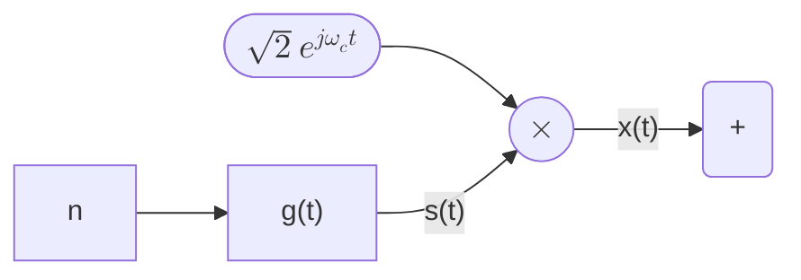

## ?

Without shift:

$$
S_z(jω) = \frac{N_0}{2} |F(jω)|^2
$$

With shift:

$$
S_z(e^{jω}) = \frac{N_0}{2T} \sum |F(e^{j(ω - 2πk/T)})|^2
$$

For a channel
$$
P(jω) = \left|G(jω) H(jω) F(jω)\right|^2
$$
