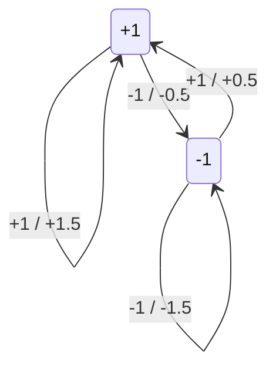
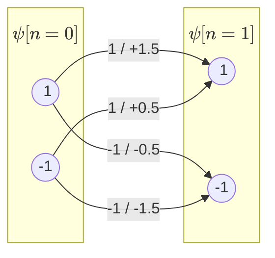
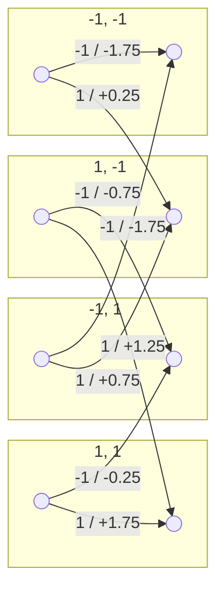
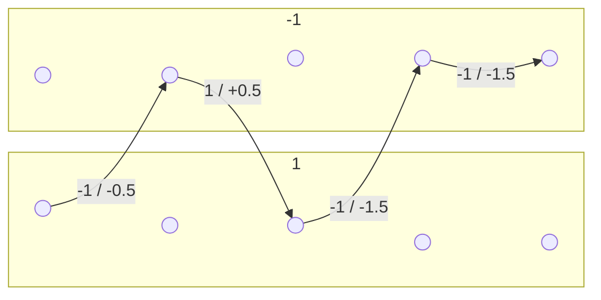
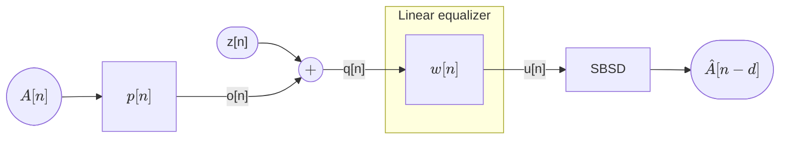

## Digital Communications <!-- omit in toc -->

# Chapter 3. Intersymbol Interference

*Academic year 2024-2025*  

---

### Table of Contents

* [Channels with ISI](#channels-with-isi)
* [Maximum Likelihood Sequence Detector](#maximum-likelihood-sequence-detector)
* [Equalizer](#equalizer)
    * [Zero-forcing equalizer](#zero-forcing-equalizer)
    * [MMSE equalizer](#mmse-equalizer)
    * [Probability of error](#probability-of-error)

---

## Channels with ISI


In the case where the channel has ISI ($p[n] ≠ δ[n]$), the optimum decisor/detector can **not** make
decision based on a symbol-by-symbol basis. Instead, it must consider the sequence of symbols. We
will use a Maximum Likelihood Sequence Detector. Let our transmitted sequence of $L$ symbols be

$$
\bar{A} = \Big[A[0], A[1], …, A[L-1]\Big]
$$

Where $A[n]$ can take $M$ different values. The number of possible sequences of length $L$ is $M^L$.

Our channel in this case is causal and *does* have ISI. Its discrete representation is

$$
p[n] = p[0] δ[n] + … + p[L_p] δ[n - L_p]
$$

Where $L_p+1$ is the **channel length**

The received sequence vector is

$$
\bar{q} = \Big[q[0], q[1], …, q[L_q-1]\Big]
$$

Where $L_q$ is the **output length** of the channel (yet unknown), and

$$
q[n] = \sum_{k=0}^{L_p} p[k] A[n-k] + z[n]
$$

In order to observe the effect of $p$ on $q$, we'll expand this sum for each $n$.

$$
\begin{aligned}
    q[0] &= p[0] A[0] + p[1] A[-1] + … + p[L_p] A[-L_p] + z[0] \\
    q[1] &= p[0] A[1] + p[1] A[0] + p[2] A[-1] + … + p[L_p] A[-L_p+1] + z[1] \\
    &\vdots \\
    q[L_p] &= p[0] A[L_p] + p[1] A[L_p-1] + … + p[L_p] A[0] + z[L_p] \\
    &\vdots \\
    q[L-1] &= p[0] A[L-1] + p[1] A[L-2] + … + p[L_p] A[L-L_p-1] + z[L-1] \\
    q[L] &= p[0] A[L] + p[1] A[L-1] + … + p[L_p] A[L-L_p] + z[L] \\
    &\vdots \\
    q[L+L_p-1] &= p[0] A[L+L_p-1] + p[1] A[L+L_p-2] + … + p[L_p] A[L-1] + z[L+L_p-1]
\end{aligned}
$$

Note three things about the output sequence:

* The first $L_p$ terms of $q[n]$ depend on symbols transmitted *before* $\bar{A}$: $A[-L_p], …,
  A[-1]$.
* The first output symbol which has information *outside* our transmitted sequence is $q[L]$: it has
  a term that depends on $A[L]$, which is outside of $\bar{A}$.
* The last output symbol that depends on $\bar{A}$ is $q[L+L_p-1]$, which has a term that
  depends on $A[L-1]$.

Now, we can define our output length $L_q = L + L_p$. If we define the noiseless vector $\bar{o}$,
its length will be the same.

We can also give a name to the symbols outside of $\bar{A}$ that affect the output sequence:

$$
\underbrace{A[-L_p], …, A[-1]}_{\displaystyle L_p \text{ past symbols}},
\underbrace{\Big[A[0], …, A[L-1]\Big]}_{\displaystyle \bar{A}},
\underbrace{A[L], …, A[L+L_p-1]}_{\displaystyle L_p \text{ future symbols}}
$$

Where the information ouside of $\bar{A}$ required to determine the output is called the "side
information".

## Maximum Likelihood Sequence Detector

Our possible sequences are $\bar{A}_1, \bar{A}_2, …, \bar{A}_{M^L}$:

$$
\begin{aligned}
    \bar{A}_1 &= \Big[A_1[0], A_1[1], …, A_1[L-1]\Big] \\
    \bar{A}_2 &= \Big[A_2[0], A_2[1], …, A_2[L-1]\Big] \\
    &\vdots \\
    \bar{A}_{M^L} &= \Big[A_{M^L}[0], A_{M^L}[1], …, A_{M^L}[L-1]\Big]
\end{aligned}
$$

In order to find an MLSD, we need to define the **likelihood function**:

$$
f_{\bar{q} | \bar{A}}(\bar{q} | \bar{A} = \bar{A}_i)
$$

Taking into account all possible sequences, the maximum likelihood would be taken from the
folllowing set of likelihoods:

$$
\left.\begin{aligned}
f_{\bar{q} | \bar{A}}(\bar{q} | \bar{A} &= \bar{A}_1) \\
f_{\bar{q} | \bar{A}}(\bar{q} | \bar{A} &= \bar{A}_2) \\
&\vdots \\
f_{\bar{q} | \bar{A}}(\bar{q} | \bar{A} &= \bar{A}_{M^L})
\end{aligned}\right\} \text{ max}
$$

If you take a moment to think about the magnitude of the calculations required to compute this, you
may realize that the number of likelihoods we need to calculate is $M^L$. Given that sequences are
usually long, this is a worrying magnitude.

In order to solve this, let's take a look at this problem from a different perspective. We can
redefine the output symbols as follows

$$
q[n] = \sum_{k=0}^{L_p} p[k] A[n-k] + z[n] = o[n] + z[n]
$$

If the transmitted sequence were known

$$
q[n] \Bigg|_{\bar{A} = \bar{A}_i} = \sum_{k=0}^{L_p} p[k] A_i[n-k] + z[n] = o_i[n] + z[n]
$$

Where $o_i[n]$ is a known constant and $z[n]$ is a White Gaussian noise (zero mean) with variance
$σ_z^2$. This makes $q[n]$ a Gaussian random variable, with mean $o_i[n]$ and variance $σ_z^2$.

Recall that, for a vector of independent random variables, the probability density function is the
product of the individual probability density functions.

$$
f_{\bar{X}} (\bar{x}) = f_{X_1, X_2, …, X_n} (x_1, x_2, …, x_n) = ∏_{i=1}^n f_{X_i} (x_i)
$$

If $z[n]$ is white, then the value at each $n$ is independent of the value at any other $n$. This
translates to the same property for $q[n]$, for which each $q[n]$ is independent of any other.
Therefore,

$$
\begin{aligned}
    f_{\bar{q}|\bar{A}} \left(\Big[q[0], q[1], …, q[L_q-1]\Big] \middle| \bar{A} = \bar{A}_i\right)
    &= ∏_{n=0}^{L_q-1} f_{q[n] | \bar{A}} \left(q \middle| \bar{A} = \bar{A}_i\right) \\
    &= \frac{1}{(2πσ_z^2)^{\frac{L_q}{2}}}
        e^{\displaystyle -\frac{∑_{n=0}^{L_q-1} |q[n]-o_i[n]|^2}{2σ_z^2}}\\
    &= \frac{1}{(2πσ_z^2)^{\frac{L_q}{2}}}
        e^{\displaystyle -\frac{d^2(\bar{q}, \bar{o}_i)}{2σ_z^2}}
\end{aligned}
$$

> **Example**
>
> Let's consider an M-PAM system with $A[n] = ±1$, $L=4$, and $p[n] = δ[n] + 0.5δ[n-1]$
>
> Decide the maximum ML transmitted sequence when the observations are:
>
> $$
> q[0] = +0.5 \quad q[1] = -0.4 \quad q[2] = +0.1 \quad q[3] = -1.7 \quad q[4] = +0.3
> $$
>
> We'd build all possible sent sequence and their corresponding output sequences before noise,
> followed by the likelihood metric calculated for each sequence. Then, we'd choose the sequence with
> the lowest metric.
>
> | $A[0]$ | $A[1]$ | $A[2]$ | $A[3]$ | $o[0]$ | $o[1]$ | $o[2]$ | $o[3]$ | $o[4]$ | Likelihood metric |
> | :---: | :---: | :---: | :---: | :---: | :---: | :---: | :---: | :---: | :--------------: |
> | +1 | +1 | +1 | +1 | +1.5 | +1.5 | +1.5 | +1.5 | +1.5 |  18.25 |
> | +1 | +1 | +1 | +1 | +1.5 | +1.5 | +1.5 | +1.5 | +1.5 | -18.25 |
> | -1 | +1 | +1 | +1 | -0.5 | +0.5 | +1.5 | +1.5 | +1.5 | -15.45 |
> | +1 | -1 | +1 | +1 | +1.5 | -0.5 | +0.5 | +1.5 | +1.5 | -12.85 |
> | -1 | -1 | +1 | +1 | -0.5 | -1.5 | +0.5 | +1.5 | +1.5 | -14.05 |
> | +1 | +1 | -1 | +1 | +1.5 | +1.5 | -0.5 | +0.5 | +1.5 | -11.25 |
> | -1 | +1 | -1 | +1 | -0.5 | +0.5 | -0.5 | +0.5 | +1.5 |   8.45 |
> | +1 | -1 | -1 | +1 | +1.5 | -0.5 | -1.5 | +0.5 | +1.5 |   9.85 |
> | -1 | -1 | -1 | +1 | -0.5 | -1.5 | -1.5 | +0.5 | +1.5 | -11.05 |
> | +1 | +1 | +1 | -1 | +1.5 | +1.5 | +1.5 | -0.5 | +0.5 |   8.05 |
> | -1 | +1 | +1 | -1 | -0.5 | +0.5 | +1.5 | -0.5 | +0.5 |   5.25 |
> | +1 | -1 | +1 | -1 | +1.5 | -0.5 | +0.5 | -0.5 | +0.5 |   2.65 |
> | -1 | -1 | +1 | -1 | -0.5 | -1.5 | +0.5 | -0.5 | +0.5 |   3.85 |
> | +1 | +1 | -1 | -1 | +1.5 | +1.5 | -0.5 | -1.5 | +0.5 |   5.05 |
> | -1 | +1 | -1 | -1 | -0.5 | +0.5 | -0.5 | -1.5 | +0.5 |   2.25 |
> | +1 | -1 | -1 | -1 | +1.5 | -0.5 | -1.5 | -1.5 | +0.5 |   3.65 |
> | -1 | -1 | -1 | -1 | -0.5 | -1.5 | -1.5 | -1.5 | +0.5 |   4.85 |

In order to make this large number of calculations more manageable, we can use the following
approach, looking at the sequence of symbols as a shifting register, where the output is a
convolution.


This can be thought of as a state machine, where the state at symbol $n$ is given by

$$
ψ[n]= \Big[A[n-L_p], A[n-L_p+1], …, A[n-1]\Big]
$$

> **Example**

Let us take the previous example and represent the input, output and state using a state diagram,
where each state is the sequence of past symbols relevant to the output, $A[n-1] … A[-L_p]$ and each
transition has the form `A[n] / o[n]`



We can represent the sequence as a Trellis diagram, where each node is a state, each branch is a
symbol applied to the state, each column is a sample, and each path is a possible sequence.

```mermaid
%%{init: {'forceLegacyMathML':'true'} }%%
graph LR

```

Furthermore, using a Trellis diagram, we can have a temporal representation of this state diagram,
where each node is a state, each branch is a symbol applied to the state, each column is the set of,
possible states at a given index, and each path is a possible sequence.



Let's see this diagram in the case where $L_p = 2$, which gives us 4 possible states.



Let's see an example for $L_p = 1$ again, but with the following sequence:

$$
\bar{A} = \{-1, 1, -1, -1\}
$$



That's how it looks when we know the sequence beforehand. But the case is that we usually don't, and
we have to determine the most likely one given an output. Say we have the following output:

$$
\bar{q} = \{0.5, -0.4, 0.1, -1.7, 0.3\}
$$

## Equalizer

So far, we've seen two options for a detector:

* **SBSD**: Symbol-by-symbol detector, which is only acceptable when the channel
  has no ISI. In other cases, its performance is very poor.
* **MLSD**: Maximum Likelihood Sequence Detector, which is the optimum detector
  for channels with ISI. However, it is very costly.

We'll settle for a middle ground: the **Equalizer**. This is a suboptimal
detector that is less costly than the MLSD, but more efficient than the SBSD.
There are several ways of implementing an equalizer:

* Linear: modeled as a linear filter
* Non-linear equalizer: might include feedback after the decision (DFE)
* Other: adaptive, machine learning, etc.

We'll focus on a linear model



We have two objectives:

* To minimize the ISI
* To minimize the noise

We're mostly interested in the the new output $u[n]$, which is the output of the
equalizer. Its definition is as follows

$$
\begin{aligned}
    u[n] &≐ q[n]*w[n] \\
    &= A[n] * \underbrace{p[n] * w[n]}_{c[n]} + \underbrace{z[n] * w[n]}_{z'[n]} \\
    &= ∑_k c[k] A[n-k] + z'[n] \\
    &= c[d] A[n-d] +
        \underbrace{\underbrace{∑_{k≠d} c[k] A[n-k]}_{\text{residual ISI}} + z'[n]}_{e_d[n]}
\end{aligned}
$$

Our perfect $w[n]$ is one such that:

1. $\text{ISI} = 0$ (Zero-forcing equalizer)
2. Minimize total error: $e_d[n] ⇊$
    * It is not possible to eliminate the noise.
    * Since noise is a random variable: minimize $\mathbb E \{|e_d[n]|^2\}$

### Zero-forcing equalizer

The zero-forcing equalizer is one such that the residual ISI is zero:

$$
∑_{k≠d} c[k] A[n-k] = 0 \\
\Uparrow \\
c[k] = 0 ∀ k ≠ d \\\
\Updownarrow \\
c[k] ∝ δ[k-d]
$$

#### C1. Implementation 1: unconstrained ZF equalizer

Let us take a shot at solving that.

$$
c[n] = p[n] * w[n] ∝ δ[n-d] \\
$$

How do you solve for $w[n]$? Don't even try. Instead, solve it in the frequency
domain:

$$
C(e^{jw}) = P(e^{jω}) W(e^{jω}) = e^{-jωd} \\
\boxed{W_{\text{uZF}}(e^{jω}) = \frac{e^{jωd}}{P(e^{jω})}}
$$

We could then take the inverse Fourier transform to get $w[n]$. Due to the fact
that we didn't take any constraints into account, this equalizer is called an
**unconstrained ZF equalizer**

#### C1. Implementation 2: constrained ZF equalizer

If the unconstrained ZF equalizer were to have an infinite number of
coefficients, we may not be able to implement it. In this case, we will
constrain our search to a filter $w[n]$ with a finite number of coefficients,
$L_w + 1$

$$
w[n] = w[0] δ[n] + w[1] δ[n-1] + … + w[L_w] δ[n-L_w]
$$

Keep in mind that we are still for a zero-forcing equalizer:

$$
\begin{aligned}
    c[n] &= p[n] * w[n] &∝ δ[n-d] \\
    &= ∑_{k=0}^{L_p} p[k] w[n-k]
\end{aligned}
$$

Let's expand that sum

$$
\begin{aligned}
    && c[0] &= w[0] p[0] \\
    && c[1] &= w[0] p[1] + w[1] p[0] \\
    && c[2] &= w[0] p[2] + w[1] p[1] + w[2] p[0] \\
    && &⋮ \\
    && c[L_p + L_w] &= w[L_w] p[L_p] \\
\end{aligned}
$$

We'll write this as system of equations, forcing all of tho coefficients to be

$$
\begin{bmatrix}
    c[0] \\
    c[1] \\
    ⋮ \\
    c[d] \\
    ⋮ \\
    c[L_p + L_w]
\end{bmatrix}
=
\begin{bmatrix}
    p[0]   & 0        & 0        & \cdots & 0 \\
    p[1]   & p[0]     & 0        & \cdots & 0 \\
    \vdots & \vdots   & \vdots   & \ddots & \vdots \\
    p[L_p] & p[L_p-1] & p[L_p-2] & \cdots & p[0] \\
    0      & p[L_p]   & p[L_p-1] & \cdots & p[1] \\
    \vdots & \vdots   & \vdots   & \ddots & \vdots \\
    0      & 0        & 0        & \cdots & p[L_p] \\
\end{bmatrix} \begin{bmatrix}
    w[0] \\
    w[1] \\
    ⋮ \\
    w[L_w]
\end{bmatrix}
$$

We are interested in solving for $w[n]$, which is done by taking the
pseudoinverse of the $\bar{P\bar{}}$ matrix

$$
\begin{aligned}
    \bar{C}_d &= \bar{\bar{P}} \bar{W}_{ZF} \\
    \bar{W}_{ZF} &= \text{pinv}(\bar{\bar{P}}) \bar{C}_d
\end{aligned}
$$

Let's see which of those are known.

We have the following condition:

$$
c[n] = δ[n-d] \\
$$

Therefore,

$$
\bar{C}_d =
\begin{bmatrix}
    c[0] \\
    c[1] \\
    ⋮ \\
    c[d] \\
    ⋮ \\
    c[L_p + L_w]
\end{bmatrix}
=
\begin{bmatrix}
    0 \\
    0 \\
    ⋮ \\
    1 \\
    ⋮ \\
    0
\end{bmatrix}
$$

### MMSE equalizer

As before, we can do this in a constrained and unconstrained way.

#### C2. Implementation 1: unconstrained MMSE equalizer

$$
\begin{aligned}
    W_{\text{uMMSE}} (e^{jω}) &= \frac{e^{-jωd} P^*(e^{jω})}{P^*(e^{jω}) P(e^{jω}) + σ_z^2} \\
    &=\frac{e^{-jωd} P^*(e^{jω})}{|P(e^{jω})|^2 + \frac{σ_z^2}{E_s}}
\end{aligned}
$$

#### C2. Implementation 2: constrained MMSE equalizer

<!-- TODO: ?? -->

### Probability of error

We have the following expression for the sequence at the output, $u[n]$

$$
\begin{aligned}
    u[n] &= c[d]A[n-d] + ∑_{k≠d} c[k] A[n-k] + z'[n] \\
    &= c[d]A[n-d] + e[n]
\end{aligned}
$$

We can approximate the probability of error as

$$
P_e ≈ Q\left(\frac{|c[d]| d_{\min}^{A[n-d]}}{2σ_{\text{error}}}\right)
$$

#### Zero-forcing unconstrained equalizer

$$
\begin{aligned}
    δ[n-d] = c[n] &= p[n] * w[n] \\
    u[n] &= A[n-d] + z[n] * w[n] \\
    &= A[n-d] + z'[n]
\end{aligned}
$$

We're interested in the noise power

$$
\begin{aligned}
    S_{z'}(e^{jw}) &= S_z(e^{jw}) |W_{\text{uZF}}(e^{jw})|^2 \\
    &= S_z(e^{jw}) \left|\frac{e^{jwd}}{P(e^{jw})}\right|^2 \\
\end{aligned}
$$

And from there, we can get $σ_{z'}^2$

$$
\begin{aligned}
    σ_{z'}^2 &= \frac{1}{2π} ∫_{-π}^π S_{z'}(e^{jw}) dw \\
    &= \frac{σ_z^2}{2π} ∫_{-π}^π \left|\frac{1}{P(e^{jw})}\right|^2 dw \\
\end{aligned}
$$

#### MMSE unconstrained equalizer

$$
\begin{aligned}
    σ_{\text{MMSE}}^2 = \frac{σ_z^2}{2π} ∫_{-π}^π \frac{1}{|P(e^{jw})|^2 + \frac{σ_z^2}{E_s}} dω
\end{aligned}
$$

#### ZF or MMSE constrained equalizer

$$
u[n] = c[d] A[n-d] + ∑_{k≠d} c[k] A[n-k] + z'[n]
$$

$$
σ_{\text{ISI}}^2 = ∑_{k=0}^{L_p+L_w} |c[k]|^2 E_s
$$

$$
σ_{z'}^2 = σ_z^2 ∑_{k=0}^{L_w} |w[k]|^2
$$

$$
P_e ≈ Q\left(\frac{|c[d]| d_{\min}^{A[n-d]}}{2 \sqrt{σ_{\text{ISI}}^2 + σ_{z'}^2}}\right)
$$
