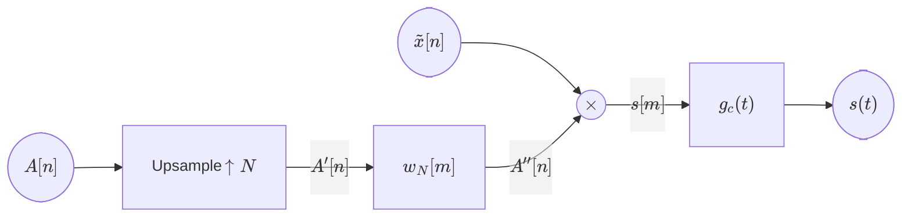
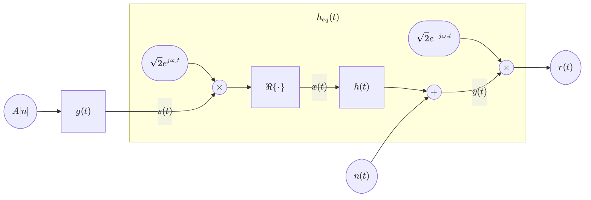
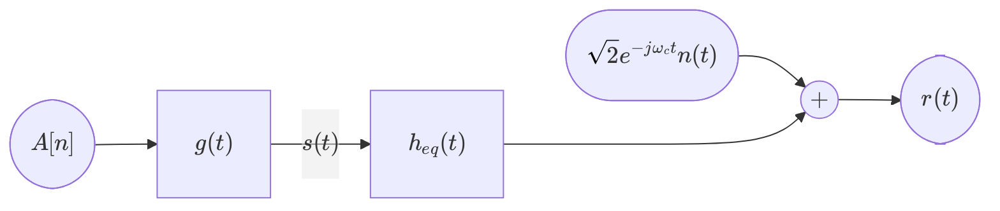
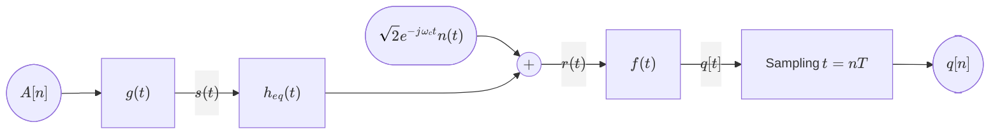
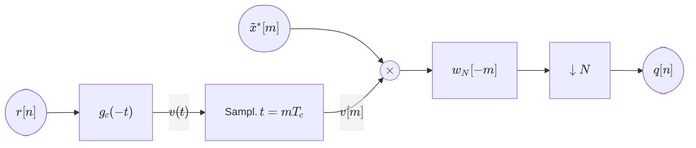
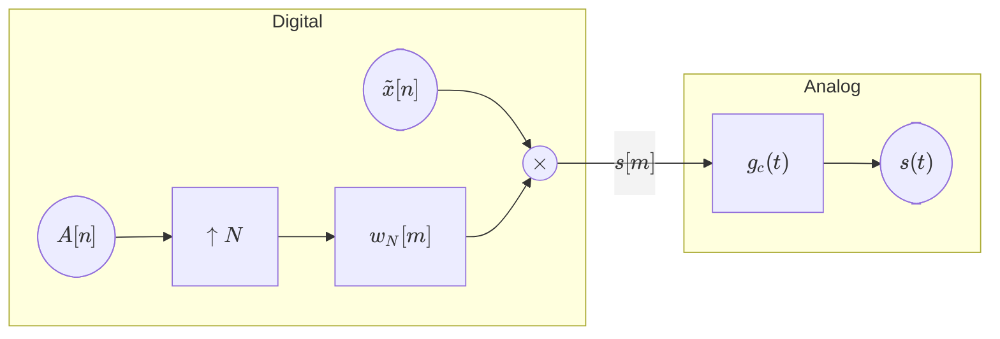
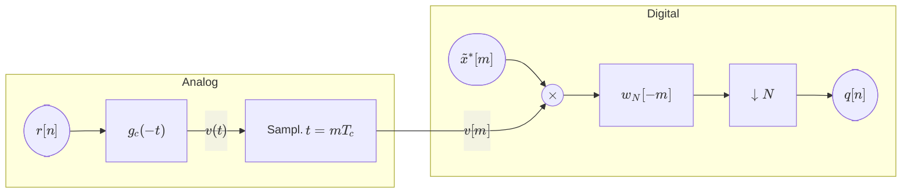
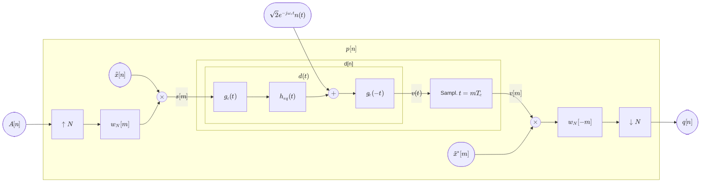
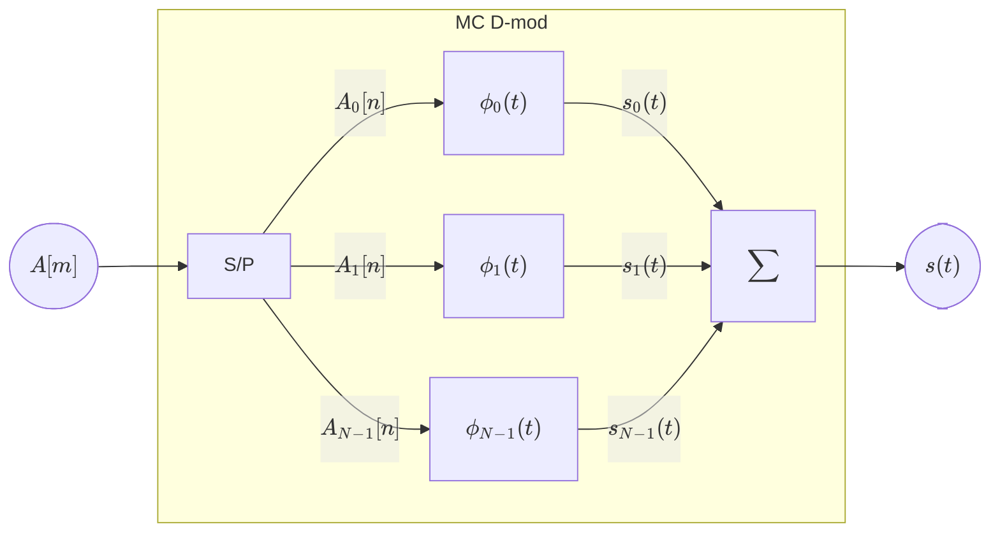

## Digital Communications <!-- omit in toc -->

# Chapter 5. Multipulse Modulation

*Academic year 2024-2025*  

---

### Table of Contents

* [Introduction](#introduction)
* [Spread Spectrum (SS)](#spread-spectrum-ss)
    * [Shaping and modulation](#shaping-and-modulation)
    * [Bandpass and Transmission](#bandpass-and-transmission)
    * [Reception](#reception)
    * [Implementation](#implementation)
    * [Summary](#summary)
* [Multicarrier modulation](#multicarrier-modulation)
* [Annexed material](#annexed-material)
* [Addendum: Quick notes](#addendum-quick-notes)
    * [Cyclic prefix](#cyclic-prefix)
    * [Some formula taken from a lecture](#some-formula-taken-from-a-lecture)

---

<!--
$$
g(t) → s(t) = ∑_n A[n] g(t-nT)
$$
-->

## Introduction

Multipulse modulations are the most used in the real world. We will no longer be
working in baseband, but in **bandpass** ($ω_c≠0$), and the channels will
usually not be flat, but instead have a frequency response with *fadings*
(inverse spikes in the frequency response). Since avoiding these fadings is not
practical, we'll have to deal with them in other ways, designing a
communications system capable of working despite them.

> **:information_source: Note**
>
> Fadings are usually caused by the environment, due to the fact that the signal
> doesn't reach the receiver directly, but instead bounces off walls, floors,
> etc. This causes the signal to arrive at the receiver through different paths,
> with different delays, and thus different phases. These channels are called
> **multipath channels**.

We have several options:

* **Spread spectrum**: We'll widen the bandwidth by a factor of $N$ in order to
  make the fading impact a smaller portion of our signal. Keep in mind that the
  transimssion rate in this case does not increase by this factor, despite the
  bandwidth increasing. In fact, if the available bandwidth is limited, the
  "original" bandwidth will have to be reduced so that when it's multiplied by
  $N$, it fits in the available bandwidth. Frequency hopping is done in the
  scope of spread spectrum modulation.

* **Multicarrier modulation**: We'll divide the available bandwidth into $N$
  subbands, and we'll transmit the signal in each of these subbands, having each
  subband carry a portion of the signal.

## Spread Spectrum (SS)

Take the case where we use an RCF filter to provive a symbol rate of $R_s$. Our
occupied bandwidth would be:

$$
R_s(1+α)
$$

If we wanted to use spread spectrum, we'd literatlly spread the signal over a
wider bandwidth, one that is $N$ times wider. This means that the occupied
bandwidth would be

$$
NR_s(1+α)
$$

Let's see how this affects the time domain:

Let our previous modulation be one that transmits one symbol every $T$ seconds.
Since we're multiplying the bandwidth by $N$, we're transmitting at a frequency
$N$ times higher, meaning we should be transmitting the same information in
$T/N$ seconds. This period will be called **chip time** $T_c$.

Since we're not changing the symbol rate, we'll actually use the whole $T$
seconds to transmit the same information, but we'll be transmitting it $N$
times in different ways.

The way we do this is by defining a shaping filter $g(t)$ in the following way:

* Our repeated signal will be $g_c(t)$
* Each instance of this repeated signal will be multiplied by a coefficient
  $x[m]$
* Each train of N instances will shape the symbol $A[n]$

$$
g(t) = ∑_m^{N-1} g_c(t-\frac{T}{N}m)x[m]
$$

Let's give names to some of our new terms:

**Chip time**
: $T_c = \frac{T}{N}$  
  The time period in which we transmit the same information $N$ times.

**Shaping filter at chip time**
: $g_c(t) ∈ \real$  
  The shaping filter that we'll use to transmit the signal in the chip time.
  This will usually be a square root raised cosine filter.

**Spreading sequence**
: $\{x[m]\}_{m=0}^{N-1} ,\; x[n] ∈ \Complex$  
    The sequence of coefficients that we'll use to multiply the chip signal.

> **Note**
>
> We'll use the index $n$ for regular time ($nT$), and the index $m$ for chip
> time ($mT_c$).

### Shaping and modulation

Our shaped signal $s(t)$ will be:

$$
\begin{aligned}
    s(t) &= ∑_n A[n] g(t-nT) \\
    &= ∑_n A[n] ∑_{l=0}^{N-1} x[l] g_c(t-lT_c - nT) \\
    &\boxed{= ∑_n A[n] ∑_{m=nN}^{\mathclap{(n+1)N-1}} x[m-nN] g_c(t-mT_c)} \\
\end{aligned}
$$

Its PSD will be:

$$
S_s (jω) = \frac{1}{T} E_s |G(jω)|^2
$$

Where $G(jω)$ is

$$
G(jω) = G_c(jω) ∑_{l=0}^{N-1} x[l] e^{-jωlT_c}
$$

Leaving us with

$$
S_s(jω) = \frac{E_s}{T} |G_c(jω)|^2
    \underbrace{\left|∑_{l=0}^{N-1} x[l] e^{-jωlT_c}\right|^2}_{S_x(e^{jωT_c})}
$$

Where $S_x(e^{jωT_c})$ is the PSD of the spreading sequence. We'll try to make
it as white as possible, so that the PSD of the transmitted signal is flat as
well.

We can define an infinite spreading sequence, which will be periodic with period
$N$:

$$
\begin{aligned}
\tilde x[n] &= x[n \mod N] \\
&= x[0], x[1], …, x[N-1], x[0], x[1], …
\end{aligned}
$$

We can model the construction of the signal $s(t)$ as a block diagram in the
following way

Where

$$
A[n] = \{A[0], A[1], …\}
$$

$$
A'[n] = \begin{cases}
    A\left[\frac{n}{N}\right] & \text{ if } n \mod N = 0 \\
    0 & \text{ otherwise}
\end{cases}
$$

$$
A''[n] = A\left[\left⌊\frac{n}{N}\right⌋\right]
$$

$$
w_N[m] = \begin{cases}
    1 & \text{ if } 0≤m<N \\
    0 & \text{ otherwise}
    \end{cases}
$$

Some examples may be found in the adjacent files.

### Bandpass and Transmission

In order to transmit this signal, we'll usually need to move it to bandpass

As previously, we'll simplify the system using an equivalent channel $h_{eq}(t)$

### Reception

We'll always use a matched filter $f(t) = g^*(-t)$

We can find the expression of the output sequence $q[n]$ as follows:

$$
\begin{aligned}
    q[n] &= (r(t) * f(t))|_{t=nT} \\
    &= ∑_{m=0}^{N-1} x^*[m] \big(r(t) * g_c(-(t-mT_c))\big)\Big|_{t=nT} \\
    &= ∑_{m=0}^{N-1} x^*[m] \underbrace{(r(t) * g_c(-t))}_{v(t)}\Big|_{t=nT+mT_c} \\
    &= ∑_{m=0}^{N-1} x^*[m] v(t) \Big|_{t=nT + mT_c} \\
    &\boxed{= ∑_{m=0}^{N-1} x^*[m] v[m+nN]} \\
\end{aligned}
$$

We'll model this expression with $v[n]$ as a block diagram

### Implementation

When physically implementing the analog shaping filter $g(t)$, which modulates a
digitally generated sequence, we run into problems due to the fact that the
spreading sequence **is not always constant**, but may change for different
connections. Since physically changing the filter every time is not practical,
we'll try to split the filter into a controllable digital part and a fixed
analog part.

We can visualize this digital-analog split in one of the block diagrams from
before

The global transformation from $A[n]$ to $s(t)$ would be the combined shaping
filter $g(t)$

A similar split can be done for the receiving end, reusing one of the previous
block diagrams

### Summary

Let's look at the end-to-end system, from input to output symbol sequence

$$
d[m] = d(t) \Big|_{t=mT_c} = g_c(t) * h_{eq}(t) * g_c(-t) \Big|_{t=mT_c}
$$

$$
p[n] = ∑_{m=0}^{N-1} ∑_{l=0}^{N-1} x[m] x^*[l] d[nN + l - m]
$$

## Multicarrier modulation

In spread spectrum, we split the shaping filter $g(t)$ in the **time domain**:
the duration $T$ was split into $N$ parts of equal duration $T_c$. In
multicarrier modulation, we'll split the available **bandwidth** into $N$
subbands, and we'll transmit the signal in each of these subbands through
Orthogonal Frequency Division Multiplexing (**OFDM**).

An OFDM system will consume the sequence $A[n]$ at a higher rate and transmit
each one of its elements in a different subband, but all in the same period $T$.
Since it'll be consuming $N$ symbols in a period $T$, the symbol rate is

$$
R_s^{OFDM} = N R_s
$$

To keep up with the convention of using $m$ for indexing at $\frac{T}{N}$, we'll
label the source sequence as $A[m]$.

$$
s(t) = ∑_{k=0}^{N-1} s_k(t) = ∑_{k=0}^{N-1} A_k[n] ϕ_k(t-nT)
$$

Assuming the sequences $A_k[n]$ are uncorrelated, the PSD of the transmitted
signal will be

$$
S(jω) = ∑_{k=0}^{N-1} S_k(jω) = \frac{1}{T} ∑_{k=0}^{N-1} E_k |ϕ_k(jω)|^2
$$

> **Note on the details about this section**
>
> The notes on this section are sparse, as the lecture was almost entirely
> a review of the annexed material, and the content was covered very quickly.

## Annexed material

Be sure to check out the following files as well for more details on multipulse
modulation:

* [Supporting slides](./Material/5.%20Multipulse%20modulations%20(slides).pdf)
    * Alt: [AG link](https://aulaglobal.uc3m.es/mod/resource/view.php?id=5232030)

## Addendum: Quick notes

### Cyclic prefix

> **Note**: this was barely covered in the lecture, so the following explanation
> is very shaky and may not be correct.

In multicarrier modulation, iff you take the last $k$ symbols of the sequence
$s[m]$, where $k$ is the number of deltas in $d[m]$ minus 1 (the memory of
$d[m]$), and you also put them at the beginning of the sequence, you can remove
ISI and ICI.

### Some formula taken from a lecture

$$
\begin{aligned}
    q_k[n] &= ∑_{i=0}^{N-1} A_i[n] * p_{k,i}[n] + z[n]\\
    &= A_0[n] * \cancel{p_{k,0}[n]} + … + A_k[n] * p_{k,k}[n] + …
        + A_{N-1}[n] * \cancel{p_{k,N-1}[n]} \\
    &\Big\downarrow \; p_{k,i}[n] = 0 ∀ i ≠ k \\
    &= \frac{N}{T} D[k] \underbrace{A_k[n] * δ[n]}_{A_k[n]} + z[n] \\
    &= \frac{N}{T} D[k] A_k[n] + z[n] \\
\end{aligned}
$$

$$
SNR = \frac{\left(\frac{N}{T}\right)^2 |D[k]|^2 E_s}{σ_z^2}
$$

$$
\begin{aligned}
    P_e^{(k)} ≈ Q\left(\frac{\frac{N}{T}|D[k]| d_{min}^{A[n]}}{2σ_z}\right)
\end{aligned}
$$
