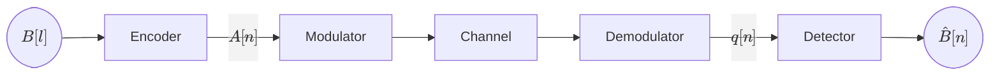
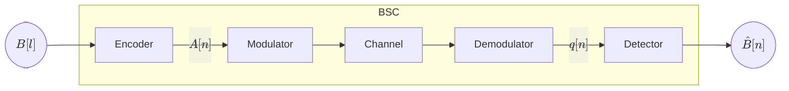
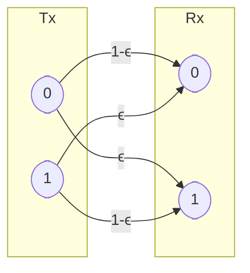
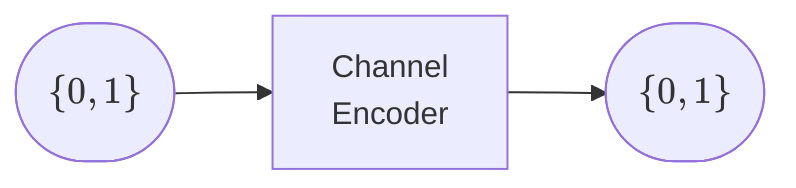
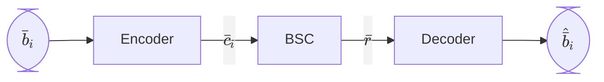

## Digital Communications <!-- omit in toc -->

# Chapter 6. Coding for Error Protection

*Academic year 2024-2025*  

---

### Table of Contents

* [Introduction](#introduction)
* [Channel encoder](#channel-encoder)
    * [Weight and distance](#weight-and-distance)
    * [Example codings](#example-codings)
* [Channel decoder](#channel-decoder)
    * [Hard decoders](#hard-decoders)
    * [Soft decoders](#soft-decoders)
* [Error correction and detection capabilities](#error-correction-and-detection-capabilities)
    * [Error correction](#error-correction)
    * [Error detection](#error-detection)
    * [Probability of error with coding](#probability-of-error-with-coding)
* [Bit rate](#bit-rate)
* [Glossary](#glossary)

---

## Introduction

In previous chapters, our channel block diagrams looked like this:

In this chapter, we're focusing on errors, so we'll summarize the channel as a
Binary Symmetric Channel (BSC):

We'll add a pair of blocks at the transmitter and receiver ends: a **channel
encoder** and a **channel decoder**. The purpose is to reduce the probability of
error, so if the original probability of error was $P_e = ϵ$, the goal is to
obtain a new probability of error $P_e^c = ϵ_c < ϵ$ (with coding).

## Channel encoder

Let's take a closer look at the first block

In general terms, for the transmission of an **input word** of $k$ bits of
information, we'll transmit a **codeword** of $n$ bits ($n>k$) by adding $n-k$
**bits of redundancy**, which contain information about the original $k$ bits.

Every **input word** is mapped to a single, unique **codeword**. The **channel
encoder** is the block that performs this mapping.

* For any given $k$, the number of possible **input words** is $2^k$, and the
  set of possible **input words** is $\{\bar{b}_i\}_{i=1}^{2^k}$.

* For any given $n$, the number of possible **codewords** of $n$ bits is still
  $2^k$, and the set of possible **codewords** is called the **code**:

    $$
    \mathcal{C} = \{\bar{c}_i\}_{i=1}^{2^k}
    $$

### Weight and distance

The **weight** of a word (input or codeword) is the number of `1`s in the word:

$$
wt(\bar{c}_i) = \text{\# of 1's in } \bar{c}_i
$$

The **Hamming distance** between two words is the number of positions in which
they differ:

$$
\begin{aligned}
    d_H(\bar{c}_i, \bar{c}_j) &= \text{\# of different bits between } \bar{c}_i \text{ and } \bar{c}_j \\
    &= wt(\bar{c}_i \oplus \bar{c}_j)
\end{aligned}
$$

The **minimum distance** of a **code** is the smallest Hamming distance between
any two different codewords:

$$
d_{min} = \min_{i \neq j} d_H(\bar{c}_i, \bar{c}_j)
$$

### Example codings

Now we'll see some examples of channel encoders.

#### Repetition coding

The simplest channel encoder is the repetition encoder. For every single bit of
information ($k=1$), we'll transmit $n$ bits, all of them equal to the original
bit.

> **Example**
>
> For $n=3$, to send a sequence `010`, we'll transmit `000 111 000`.

#### Parity coding

For every input word of $k$ bits, we'll transmit $n=k+1$ bits. The last bit is called
the **parity bit**, and it's decided based on the number of `1`s in the original
word. There are two types of parity, and both sender and receiver must agree on
which one is being used:

* For **odd parity**, the total nubmer of `1`s in the word must be odd.
* For **even parity**, the total nubmer of `1`s in the word must be even.

> **Example**
>
> For even parity with words of $k=2$ bits ($n=3$) the following table shows
> the encoding:
>
> | Original | Encoded |
> | -------- | ------- |
> | `00`     | `000`   |
> | `01`     | `011`   |
> | `10`     | `101`   |
> | `11`     | `110`   |

## Channel decoder

We can classify channel decoders into two types: **hard** and **soft decoders**

### Hard decoders

In a hard decoder, the input to the decoder are bits

Note that, while only a limited of codewords are valid, the channel can produce
any of the $2^n$ possible combinations of $n$ bits at $\bar{r}$.

We'll model the BSC as follows:

Where $\bar{e}$ is the **Error pattern**. Its length is $n$, and it's a binary
vector that represents the errors that occurred in the channel. The amount of
possible error patterns is $2^n$.

The job of the decoder is to estimate the original input word $\bar{b}_i$ based
on the received word $\bar{r}$.

In general, a hard decoder will estimate the decoded word from the code as the
one that is *closest* to the received word, which is the one with the **smallest
Hamming distance** to the received word, by calculating the Hamming distance
from the received word to **all possible codewords** and selecting the one with
the smallest distance.

> **Example**
>
> Let's take an example with **repetition coding** for $n=3$. Let's say the
> received word $\bar{r}$ is `001`. Assuming the minimum number of errors has
> occurred, by simple observation we can see that the most likely input word is
> `000`.
>
> More formally, this is done by calculating the Hamming distance between the
> received word and all possible codewords, and selecting the one with the
> smallest distance:
>
> | Codeword | Distance |
> | -------- | -------- |
> | `000`    | 1        |
> | `111`    | 2        |
>
> Therefore, the most likely input word is `000`.

### Soft decoders

In a soft decoder, the input is the observation $q$:

In this subject, the **Symbol Encoder** will always be a 2-PAM modulator,
and the noise $\bar{z}$ will be AWGN.

The **soft decoder** will estimate the input word $\bar{b}_i$ based on the
(euclidean) distance between the received symbol $\bar{q}$ and the possible
symbols $\bar{a}_i$.

There is no such thing as *error detection* in soft decoders, as the noise will
cause the received symbol to always be different from any valid symbol.

## Error correction and detection capabilities

A code's performance can be measured by its ability to correct and detect
errors.

### Error correction

A code is said to be **able to correct** $t$ errors if and only if it can
correct all error patterns with a weight of $t$ or less.

$$
\mathcal{C}\text{ corrects } t \text{ errors}
⟺ \text{correction } ∀ wt(\bar{e}) ≤ t \Big|_\mathcal{C}
$$

The number of **correctable** errors is given by:

$$
\left\lfloor \frac{d_{min} - 1}{2} \right\rfloor
$$

### Error detection

The number of **detectable** errors is given by:

$$
d_{min} - 1
$$

Any error pattern with more than $d_{min} - 1$ errors will be **undetectable**.

### Probability of error with coding

The probability of error with coding $P_e^c$ is the probability that the
estimated word is different from the original word. This is not to say that that
there was an error, or that the error was not detected, as there may have been
an error that was corrected (no error in the estimated word), or an error that
was detected but not corrected as it should (error in the estimated word).

> **Example**
>
> Let's see an example with **repetition coding** for $n=3$. The probability of
> error with coding can be calculated as:
>
> $$
> \begin{aligned}
>     P_e^c &= P(\bar{e}=011) + P(\bar{e}=110) + P(\bar{e}=101) + P(\bar{e}=111) \\
>     &= ϵ^2(1-ϵ) + ϵ(1-ϵ)^2 + ϵ(1-ϵ)^2 + (1-ϵ)^3 \\
>     &= 3ϵ^2(1-ϵ) + (1-ϵ)^3
> \end{aligned}
> $$
>
> Which, given that $ϵ$ is small, should be less than $ϵ$.

## Bit rate

Keeping in mind the *no free lunch* theorem, let's check the bit rate left after
applying coding to the channel.

Since the number of information bits sent is $k$, and the number of bits sent
after coding is $n$, the bit rate is:

$$
R_b^c = \frac{k}{n} R_b
$$

Since $n>k$, the bit rate after coding is always less than the bit rate before
coding. Furthermore, the more redundancy we add, the lower the bit rate.

## Glossary

**Input word**

: Word of $k$ bits of information to be transmitted, seen at the input.

**Codeword**

: Word of $n$ bits, obtained by encoding the input word.

**Code** — $\{\bar{c}_i\}_{i=1}^{2^k}$

: Set of possible codewords.

**Weight of a word** — $wt(\bar{c})_i$

: The number of `1`s in the word:

    $$
    wt(\bar{c}_i) = \text{\# of 1's in } \bar{c}_i
    $$

**Hamming distance** — $d_H(\bar{c}_i, \bar{c}_j)$

: Number of positions in which two words differ:

    $$
    d_H(\bar{c}_i, \bar{c}_j) = wt(\bar{c}_i \oplus \bar{c}_j)
    $$

**Minimum distance of a code** — $d_{min}$

: Smallest Hamming distance between any two different codewords in a code

    $$
    d_{min} = \min_{i \neq j} d_H(\bar{c}_i, \bar{c}_j)
    $$

**Error pattern** — $\bar{e}$

: Binary vector of length $n$ that represents the errors that occurred in the
channel (the bits that were flipped).
