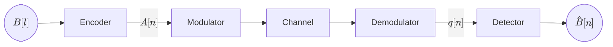
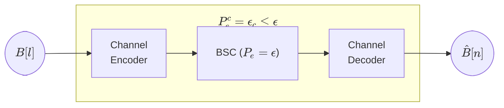
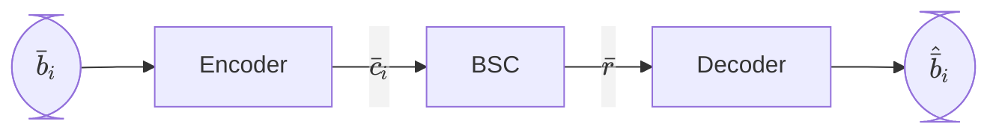
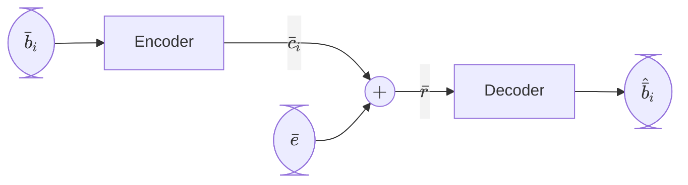
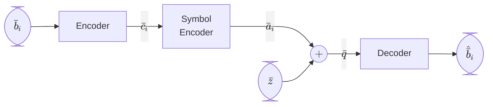
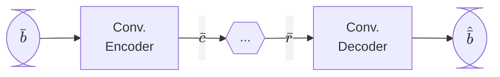
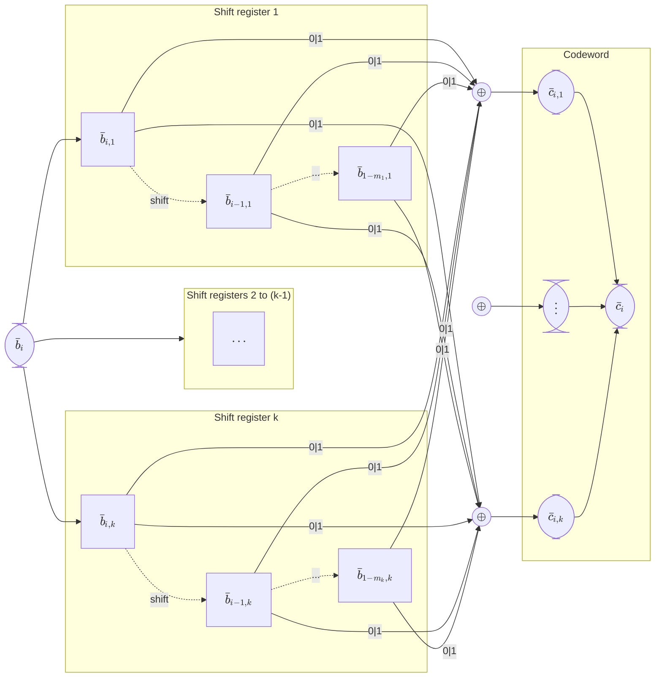
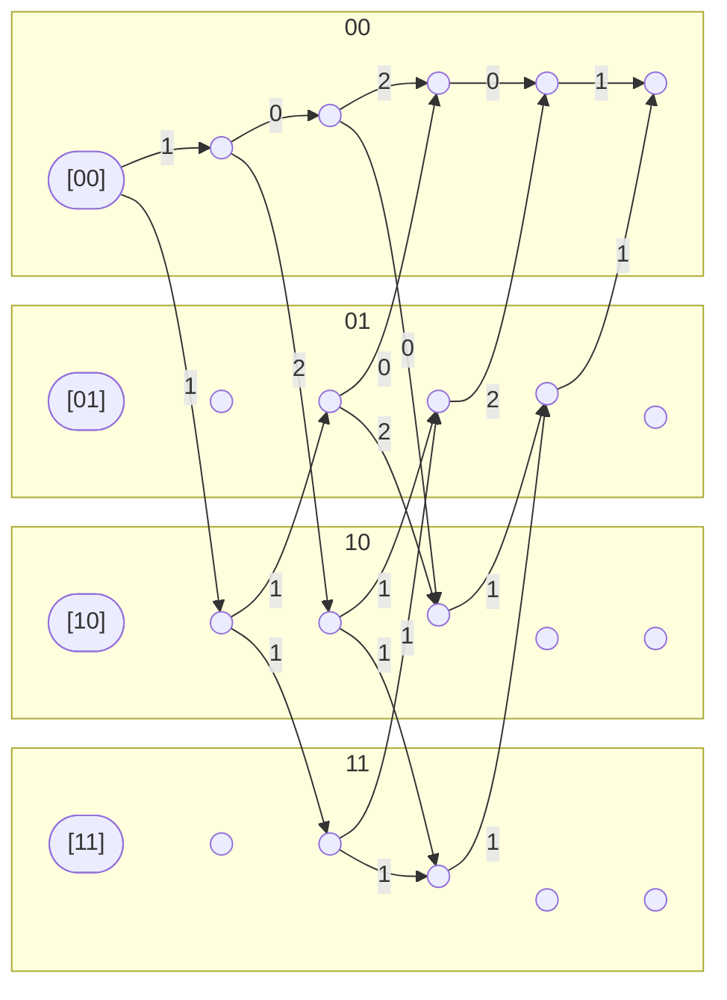

## Digital Communications <!-- omit in toc -->

# Chapter 6. Coding for Error Protection

*Academic year 2024-2025*  

---

### Table of Contents

* [Introduction](#introduction)
* [Channel encoder](#channel-encoder)
    * [Weight and distance](#weight-and-distance)
    * [Example codings](#example-codings)
* [Channel decoder](#channel-decoder)
    * [Hard decoders](#hard-decoders)
    * [Soft decoders](#soft-decoders)
* [Error correction and detection capabilities](#error-correction-and-detection-capabilities)
    * [Error correction](#error-correction)
    * [Error detection](#error-detection)
    * [Probability of error with coding](#probability-of-error-with-coding)
* [Bit rate](#bit-rate)
* [Linear block codes](#linear-block-codes)
    * [Generating matrix](#generating-matrix)
    * [Systematic linear block codes](#systematic-linear-block-codes)
    * [Decoder for Linear Block Codes](#decoder-for-linear-block-codes)
* [Glossary](#glossary)

---

## Introduction

In previous chapters, our channel block diagrams looked like this:



In this chapter, we're focusing on errors, so we'll summarize the channel as a
Binary Symmetric Channel (BSC):


We'll add a pair of blocks at the transmitter and receiver ends: a **channel
encoder** and a **channel decoder**. The purpose is to reduce the probability of
error, so if the original probability of error was $P_e = ϵ$, the goal is to
obtain a new probability of error $P_e^c = ϵ_c < ϵ$ (with coding).



## Channel encoder

Let's take a closer look at the first block


In general terms, for the transmission of an **input word** of $k$ bits of
information, we'll transmit a **codeword** of $n$ bits ($n>k$) by adding $n-k$
**bits of redundancy**, which contain information about the original $k$ bits.

Every **input word** is mapped to a single, unique **codeword**. The **channel
encoder** is the block that performs this mapping.

* For any given $k$, the number of possible **input words** is $2^k$, and the
  set of possible **input words** is $\{\bar{b}_i\}_{i=1}^{2^k}$.

* For any given $n$, the number of possible **codewords** of $n$ bits is still
  $2^k$, and the set of possible **codewords** is called the **code**:

    $$
    \mathcal{C} = \{\bar{c}_i\}_{i=1}^{2^k}
    $$

### Weight and distance

The **weight** of a word (input or codeword) is the number of `1`s in the word:

$$
wt(\bar{c}_i) = \text{\# of 1's in } \bar{c}_i
$$

The **Hamming distance** between two words is the number of positions in which
they differ:

$$
\begin{aligned}
    d_H(\bar{c}_i, \bar{c}_j) &= \text{\# of different bits between } \bar{c}_i \text{ and } \bar{c}_j \\
    &= wt(\bar{c}_i \oplus \bar{c}_j)
\end{aligned}
$$

The **minimum distance** of a **code** is the smallest Hamming distance between
any two different codewords:

$$
d_{min} = \min_{i \neq j} d_H(\bar{c}_i, \bar{c}_j)
$$

### Example codings

Now we'll see some examples of channel encoders.

#### Repetition coding

The simplest channel encoder is the repetition encoder. For every single bit of
information ($k=1$), we'll transmit $n$ bits, all of them equal to the original
bit.

> **Example**
>
> For $n=3$, to send a sequence `010`, we'll transmit `000 111 000`.

#### Parity coding

For every input word of $k$ bits, we'll transmit $n=k+1$ bits. The last bit is called
the **parity bit**, and it's decided based on the number of `1`s in the original
word. There are two types of parity, and both sender and receiver must agree on
which one is being used:

* For **odd parity**, the total nubmer of `1`s in the word must be odd.
* For **even parity**, the total nubmer of `1`s in the word must be even.

> **Example**
>
> For even parity with words of $k=2$ bits ($n=3$) the following table shows
> the encoding:
>
> | Original | Encoded |
> | -------- | ------- |
> | `00`     | `000`   |
> | `01`     | `011`   |
> | `10`     | `101`   |
> | `11`     | `110`   |

## Channel decoder

We can classify channel decoders into two types: **hard** and **soft decoders**

### Hard decoders

In a hard decoder, the input to the decoder are bits



Note that, while only a limited of codewords are valid, the channel can produce
any of the $2^n$ possible combinations of $n$ bits at $\bar{r}$.

We'll model the BSC as follows:



Where $\bar{e}$ is the **Error pattern**. Its length is $n$, and it's a binary
vector that represents the errors that occurred in the channel. The amount of
possible error patterns is $2^n$.

The job of the decoder is to estimate the original input word $\bar{b}_i$ based
on the received word $\bar{r}$.

In general, a hard decoder will estimate the decoded word from the code as the
one that is *closest* to the received word, which is the one with the **smallest
Hamming distance** to the received word, by calculating the Hamming distance
from the received word to **all possible codewords** and selecting the one with
the smallest distance.

> **Example**
>
> Let's take an example with **repetition coding** for $n=3$. Let's say the
> received word $\bar{r}$ is `001`. Assuming the minimum number of errors has
> occurred, by simple observation we can see that the most likely input word is
> `000`.
>
> More formally, this is done by calculating the Hamming distance between the
> received word and all possible codewords, and selecting the one with the
> smallest distance:
>
> | Codeword | Distance |
> | -------- | -------- |
> | `000`    | 1        |
> | `111`    | 2        |
>
> Therefore, the most likely input word is `000`.

### Soft decoders

In a soft decoder, the input is the observation $q$:



In this subject, the **Symbol Encoder** will always be a 2-PAM modulator,
and the noise $\bar{z}$ will be AWGN.

The **soft decoder** will estimate the input word $\bar{b}_i$ based on the
(euclidean) distance between the received symbol $\bar{q}$ and the possible
symbols $\bar{a}_i$.

There is no such thing as *error detection* in soft decoders, as the noise will
cause the received symbol to always be different from any valid symbol.

## Error correction and detection capabilities

A code's performance can be measured by its ability to correct and detect
errors.

### Error correction

A code is said to be **able to correct** $t$ errors if and only if it can
correct all error patterns with a weight of $t$ or less.

$$
\mathcal{C}\text{ corrects } t \text{ errors}
⟺ \text{correction } ∀ wt(\bar{e}) ≤ t \Big|_\mathcal{C}
$$

The number of **correctable** errors is given by:

$$
\left\lfloor \frac{d_{min} - 1}{2} \right\rfloor
$$

### Error detection

The number of **detectable** errors is given by:

$$
d_{min} - 1
$$

Any error pattern with more than $d_{min} - 1$ errors will be **undetectable**.

### Probability of error with coding

The probability of error with coding $P_e^c$ is the probability that the
estimated word is different from the original word. This is not to say that that
there was an error, or that the error was not detected, as there may have been
an error that was corrected (no error in the estimated word), or an error that
was detected but not corrected as it should (error in the estimated word).

> **Example**
>
> Let's see an example with **repetition coding** for $n=3$. The probability of
> error with coding can be calculated as:
>
> $$
> \begin{aligned}
>     P_e^c &= P(\bar{e}=011) + P(\bar{e}=110) + P(\bar{e}=101) + P(\bar{e}=111) \\
>     &= ϵ^2(1-ϵ) + ϵ(1-ϵ)^2 + ϵ(1-ϵ)^2 + (1-ϵ)^3 \\
>     &= 3ϵ^2(1-ϵ) + (1-ϵ)^3
> \end{aligned}
> $$
>
> Which, given that $ϵ$ is small, should be less than $ϵ$.

## Bit rate

Keeping in mind the *no free lunch* theorem, let's check the bit rate left after
applying coding to the channel.

Since the number of information bits sent is $k$, and the number of bits sent
after coding is $n$, the bit rate is:

$$
R_b^c = \frac{k}{n} R_b
$$

Since $n>k$, the bit rate after coding is always less than the bit rate before
coding. Furthermore, the more redundancy we add, the lower the bit rate.

## Linear block codes

For a code to be a **linear block code**, it must satisfy the following
property

* **Linearity**: The sum of any two codewords is also a codeword.

The following properties follow:

* The all-zero codeword is part of the code.
* The sum of any codeword with the all-zero codeword is the codeword itself.
* We can simplify the minimum distance:

    $$
    d_{min} = \min_{\bar{c}_i ≠ \bar{0}} wt(\bar{c}_i)
    $$

Linear block codes are very easy to encode and decode.

Let's look at parity coding for $k=2$ bits. The code is:

$$
\begin{aligned}
    00 &\rightarrow 000 = \bar{c}_1 \\
    01 &\rightarrow 011 = \bar{c}_2\\
    10 &\rightarrow 101 = \bar{c}_3\\
    11 &\rightarrow 110 = \bar{c}_4
\end{aligned}
$$

It is simple to check that this code is linear.

### Generating matrix

Let's keep going with the example above. Observe that we can choose two
**non-zero linearly independent codewords** and generate the remaining codeword
by performing **linear combinations** of these two codewords (including the
all-zero, which is obtained by multiplying by zero).

Let's take the second and third codewords and call them **generating codewords**

$$
\bar{g}_1 = 011; \quad \bar{g}_2 = 101
$$

And let's now write the rest of the code as linear combinations of these two,
and express it in matrix multiplication form:

$$
\def\gmatrix {
    \begin{bmatrix}
        \bar{g}_1 \\
        \bar{g}_2
    \end{bmatrix}
}
c_1 = 000 = 0⋅\bar{g}_1 + 0⋅\bar{g}_2 = [0 \; 0] ⋅ \gmatrix \\[0.5em]
c_2 = 011 = 1⋅\bar{g}_1 + 0⋅\bar{g}_2 = [1 \; 0] ⋅ \gmatrix \\[0.5em]
c_3 = 101 = 0⋅\bar{g}_1 + 1⋅\bar{g}_2 = [0 \; 1] ⋅ \gmatrix \\[0.5em]
c_4 = 110 = 1⋅\bar{g}_1 + 1⋅\bar{g}_2 = [1 \; 1] ⋅ \gmatrix
$$

The matrix we can see on the right side of the equations is called the
**generating matrix**, a $k$ by $n$ matrix that contains the generating
codewords as rows:

$$
\overline{\overline{G}} = \begin{bmatrix}
    \bar{g}_1 \\
    \bar{g}_2 \\
    \vdots \\
    \bar{g}_k
\end{bmatrix}
$$

For any linear block code, the generating matrix can be used to generate all the
codewords in the code.

### Systematic linear block codes

A **systematic linear block code** is a linear block code where the generating
matrix has the following form:

$$
\overline{\overline{G}} = \begin{bmatrix}
    \begin{array}{c:c}
    \overline{\overline{I}}_k & \overline{\overline{P}} \\
    \end{array}
\end{bmatrix}
$$

Where $\overline{\overline{I}}_k$ is the $k$ by $k$ identity matrix, and
$\overline{\overline{P}}$ is a $k$ by $n-k$ matrix called the **parity matrix**.
The order can be reversed, having the parity matrix on the left side.

As every codeword can be generated by multiplying the input word by the
generating matrix, we get the following property:

$$
\begin{aligned}
    \bar{c}_i &= \bar{b}_i ⋅ \overline{\overline{G}} \\
    &= \bar{b}_i ⋅ \begin{bmatrix}
        \begin{array}{c:c}
            \overline{\overline{I}}_k & \overline{\overline{P}} \\
        \end{array}
    \end{bmatrix} \\
    &= \begin{bmatrix}
        \begin{array}{c:c}
            \bar{b}_i\overline{\overline{I}}_k & \bar{b}_i\overline{\overline{P}} \\
        \end{array}
    \end{bmatrix} \\
    &= \begin{bmatrix}
        \begin{array}{c:c}
            \bar{b}_i & \bar{b}_i\overline{\overline{P}} \\
        \end{array}
    \end{bmatrix}
\end{aligned}
$$

#### Conversion into systematic form

Since systematic linear block codes are so useful, we are often interested in
converting a given linear block code into a systematic form. This can be done by
transforming the generating matrix by doing Gaussian elimination on the G matrix
until the identity matrix is obtained on the left (or right) side.

> **Example**
>
> Let's take the following generating matrix:
>
> $$
> \overline{\overline{G}} = \begin{bmatrix}
>     1 & 1 & 0 \\
>     0 & 1 & 1
> \end{bmatrix}
> $$
>
> By adding the second row to the first row, we get:
>
> $$
> \overline{\overline{G'}} = \begin{bmatrix}
>     1 & 0 & 1 \\
>     0 & 1 & 1
> \end{bmatrix}
> $$
>
> Which *is* in systematic form.

### Decoder for Linear Block Codes

Instead of calculating the Hamming distance between the received word and all
possible codewords, having a Linear Block Code allows us to greatly simplify the
decoding process of transforming the received word $\bar{r}$ into the estimated
codeword $\hat{\bar{c}}$

Given the generating matrix $\overline{\overline{G}}$, we can find an orthogonal
matrix $\overline{\overline{H}}_{(n-k)×n}$ called the **parity-check matrix**:

$$
\overline{\overline{G}} ⋅ \overline{\overline{H}}^T = \overline{0}
$$

If we have a **systematic** generating matrix, the parity-check matrix is
very easy to obtain:

$$
\overline{\overline{G}} = \begin{bmatrix}
    \begin{array}{c:c}
    \overline{\overline{I}}_{k} & \overline{\overline{P}} \\
    \end{array}
\end{bmatrix} ⟹ \overline{\overline{H}} = \begin{bmatrix}
    \begin{array}{c:c}
    \overline{\overline{P}}^T & \overline{\overline{I}}_{n-k} \\
    \end{array}
\end{bmatrix} \\[0.5em]

\overline{\overline{G}} = \begin{bmatrix}
    \begin{array}{c:c}
    \overline{\overline{P}} & \overline{\overline{I}}_{k} \\
    \end{array}
\end{bmatrix} ⟹ \overline{\overline{H}} = \begin{bmatrix}
    \begin{array}{c:c}
    \overline{\overline{I}}_{n-k} & \overline{\overline{P}}^T \\
    \end{array}
\end{bmatrix}
$$

Now, observe what happens when a valid codeword is received and multiplied by the
parity-check matrix:

$$
\bar{c}_i ⋅ \overline{\overline{H}}^T
    = \bar{b}_i ⋅ \overline{\overline{G}} ⋅ \overline{\overline{H}}^T
    = \bar{0}
$$

However, if there are errors, the received word $\bar{r}$ is not a valid
codeword, and the product will not be the all-zero vector. This is called the
**syndrome**:

$$
\begin{aligned}
    \bar{s} &= \bar{r} ⋅ \overline{\overline{H}}^T \\
        &= (\bar{c}_i + \bar{e}) ⋅ \overline{\overline{H}}^T \\
        &= \bar{e} ⋅ \overline{\overline{H}}^T \\
\end{aligned}
$$

We can use the parity-check matrix and the syndrome to detect and correct
errors.

#### Step 1: Error-syndrome table

The first step is to build an **error-syndrome table**, where each error pattern
is multiplied by the parity-check matrix to obtain the corresponding syndrome.

| Error pattern | Syndrome                                            |
| :-----------: | --------------------------------------------------- |
|  $\bar{e}_1$  | $\bar{s}_1 = \bar{e}_1 ⋅ \overline{\overline{H}}^T$ |
|  $\bar{e}_2$  | $\bar{s}_2 = \bar{e}_2 ⋅ \overline{\overline{H}}^T$ |
|   $\vdots$    | $\vdots$                                            |
|  $\bar{e}_N$  | $\bar{s}_N = \bar{e}_N ⋅ \overline{\overline{H}}^T$ |

There is a total of $N = 2^{n-k}$ possible syndromes, one for each possible
combination of $n$ bits that is not a valid codeword.

#### Step 2: Obtain the syndrome of the received word

The second step is to obtain the syndrome of the received word $\bar{r}$:

$$
\bar{s} = \bar{r} ⋅ \overline{\overline{H}}^T
$$

#### Step 3: Look up the syndrome in the table

The last step is to look up the syndrome in the table and correct the error
associated to it.

## Convolutional codes

As opposed to block codes, convolutional codes are *filter-like*, and they
can work in the digital domain.



### Convolutional encoder

A convolutional encoder does not only encode $k$ bits of information into
$n$ bits, but it has a **memory of $m$ words**, which means that the encoded
word $\bar{c}_i$ of length $k$ depends on the current input word $\bar{b}_i$ and
the $m-1$ previous input words: $\{\bar{b}_i\}_{i=i-1}^{i-m}$.

We can model the processing as an operation on **shift registers**:



We will model the memory 'shift register' for each bit of the input word
**independently**, which means in some cases we can have different values of $m$
for each of the $k$ bits of the input word: $\{m_j\}_{j=1}^{k}$. Only if they
are all equal we can say that the convolutional encoder has a memory of $m$.

The encoder can be modeled as a **finite state machine** with $2^{m*k}$ states
(or $2^{∑_{j=1}^{k} m_j}$ if the memory is different for each bit), and we can
represent the transitions between states as a **trellis diagram**.

> **Example**
>
> Let's see an example for a convolutional encoder with $k=1$, $n=2$ and $m=1$:
>
> Let our codeword be defined as:
>
> * $\bar{c}_i,1 = \bar{b}_i \oplus \bar{b}_{i-1} \oplus \bar{b}_{i-2}$
> * $\bar{c}_i,2 = \bar{b}_i \oplus \bar{b}_{i-2}$
>
> We can represent that transition as an operation on shift registers:
>
> ```mermaid
> %%{init: {'forceLegacyMathML':'true'} }%%
> flowchart LR
> 
> 
> ```
>
> We can also represent it as a state diagram:
>
> ```mermaid
> %%{init: {'forceLegacyMathML':'true'} }%%
> stateDiagram-v2
> 00 --> 00: 0 | 00
> 00 --> 10: 1 | 11
> 10 --> 01: 0 | 01
> 10 --> 11: 1 | 10
> 01 --> 00: 0 | 11
> 01 --> 10: 1 | 00
> 11 --> 01: 0 | 10
> 11 --> 11: 1 | 01
> ```
>
> Or as a trellis diagram:
>
> ```mermaid
> %%{init: {'forceLegacyMathML':'true'} }%%
> flowchart LR
> 
> subgraph s11 ["11"]
>     s11a(["[11]"]); s11b((" "))
> end
> subgraph s10 ["10"]
>     s10a(["[10]"]); s10b((" "))
> end
> subgraph s01 ["01"]
>     s01a(["[01]"]); s01b((" "))
> end
> subgraph s00 ["00"]
>     s00a(["[00]"]); s00b((" "))
> end
> 
> s00a --"0 | 00"--> s00b
> s00a --"1 | 11"--> s10b
> s01a --"0 | 11"--> s00b
> s01a --"1 | 00"--> s10b
> s10a --"0 | 01"--> s01b
> s10a --"1 | 10"--> s11b
> s11a --"0 | 10"--> s01b
> s11a --"1 | 01"--> s11b
> ```

### Convolutional decoder

The ideal convolutional decoder is a **Viterbi decoder** and a **hard decoder**

We can represent the decoding process as a trellis diagram, where every
transition is labeled with the **Hamming distance** between the received word
and the expected codeword for that transition

> **Example**

Let's visualize the process of decoding the following word using the same
convolutional encoder as before:

$$
\bar{r} = 10 \, 00 \, 11 \, 00 \, 01
$$

Assuming the beginning and ending states are `00`:



### Convolutional code distance

The *distance* for a convolutional code is $D_{min}$, the minimum distance
between two different paths. The procedure for finding that can be found in previous chapters.

<!-- ======================================================================= -->

## Glossary

**Input word**

: Word of $k$ bits of information to be transmitted, seen at the input.

**Codeword** — $\bar{c}_i$

: Word of $n$ bits, obtained by encoding the input word.

**Code** — $\mathcal C = \{\bar{c}_i\}_{i=1}^{2^k}$

: Set of possible codewords. Note that the number of words that can be encoded
is $2^k$. This does mean that not all possible combinations of $n$ bits are
valid codewords.

**Weight of a word** — $wt(\bar{c}_i)$

: The number of `1`s in the word:

    $$
    wt(\bar{c}_i) = \text{\# of 1's in } \bar{c}_i
    $$

**Hamming distance** — $d_H(\bar{c}_i, \bar{c}_j)$

: Number of positions in which two words differ:

    $$
    d_H(\bar{c}_i, \bar{c}_j) = wt(\bar{c}_i \oplus \bar{c}_j)
    $$

**Minimum distance of a code** — $d_{min}$

: Smallest Hamming distance between any two different codewords in a code

    $$
    d_{min} = \min_{i \neq j} d_H(\bar{c}_i, \bar{c}_j)
    $$

**Error pattern** — $\bar{e}$

: Binary vector of length $n$ that represents the errors that occurred in the
channel (the bits that were flipped).

**Generating codewords** — $\{\bar{g}_i\}_{i=1}^{k}$

: Set of linearly independent codewords needed to generate all the codewords in
a linear block code.

**Generating matrix** — $\overline{\overline{G}}$

: $k$ by $n$ matrix which contains the generating codewords as rows:

    $$
    \overline{\overline{G}}_{k×n} = \left. \begin{bmatrix}
        \bar{g}_1 \\
        \bar{g}_2 \\
        \vdots \\
        \underbrace{ \bar{g}_k}_{n}
    \end{bmatrix} \right\} k
    $$

**Systematic linear block code**

: Linear block code where the generating matrix contains the identity matrix as
the first $k$ columns.

    $$
    \text{Systematic} ⟺
    \overline{\overline{G}} = \begin{bmatrix}
        \begin{array}{c:c}
        \overline{\overline{I}}_k & \overline{\overline{P}} \\
        \end{array}
    \end{bmatrix}
    $$

**Parity matrix** — $\overline{\overline{P}}$

: $k$ by $n-k$ matrix that contains the parity bits of a systematic linear block
code.

**Parity-check matrix** — $\overline{\overline{H}}_{(n-k)×n}$

: Orthogonal matrix to the generating matrix, such that the product of both is
the all-zero vector.

    For a systematic linear block code, the parity-check matrix is:

$$
\overline{\overline{G}} = \begin{bmatrix}
    \begin{array}{c:c}
    \overline{\overline{I}}_{k} & \overline{\overline{P}} \\
    \end{array}
\end{bmatrix} ⟹ \overline{\overline{H}} = \begin{bmatrix}
    \begin{array}{c:c}
    \overline{\overline{P}}^T & \overline{\overline{I}}_{n-k} \\
    \end{array}
\end{bmatrix} \\[0.5em]

\overline{\overline{G}} = \begin{bmatrix}
    \begin{array}{c:c}
    \overline{\overline{P}} & \overline{\overline{I}}_{k} \\
    \end{array}
\end{bmatrix} ⟹ \overline{\overline{H}} = \begin{bmatrix}
    \begin{array}{c:c}
    \overline{\overline{I}}_{n-k} & \overline{\overline{P}}^T \\
    \end{array}
\end{bmatrix}
$$

**Syndrome**

: Vector obtained by multiplying the received word by the parity-check matrix.

    $$
    \bar{s} = \bar{r} ⋅ \overline{\overline{H}}^T
    $$
