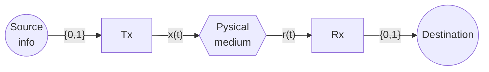
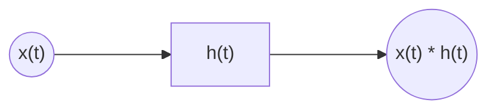
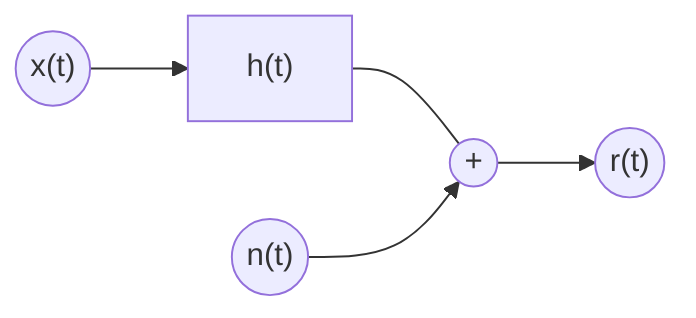
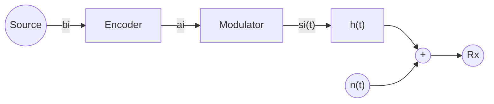
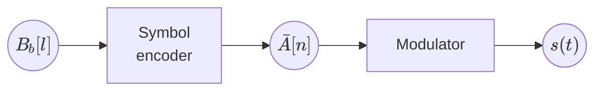
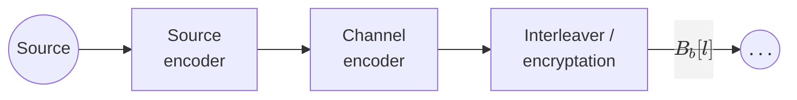

# Chapter 1. Introduction

* Baseband vs Bandpass Channels
* Single symbol Tx vs multi-symbol Tx
* BLock diagram of a digital communications system



$$
r(t) = f(x(t)) + n(t) = h(t) * x(t) + n(t)
$$

Where $f(x(t))$ is a linear function



> **Example** of probability of error
>
> Assuming both transmitter and receiver are optimized, assume we send the sequence `0011011010` and
> receive `1011011011`. THe probaility of error is $P_e = \frac{2}{10} = 20%$

## Noise



<!-- ```mermaid
xychart-beta
line [0, 0, 0, 1, 1, 1, 1, 0, 0, 0]
```
-->



* $B$: symbols in binary format
* $N$: dimension
* $M$: number of combinations
* $\bar{A}$: constellation, symbols in vector format

> **Example**
>
> Let $M=4$. The alphabet and constellation are:
>
> $$
> \begin{cases}
> b_1 = 00 \\
> b_2 = 01 \\
> b_3 = 10 \\
> b_4 = 11
> \end{cases}
> $$
>
> $$
> \bar{A} = \left\{
>     \begin{bmatrix}
>         1 \\
>         1
>     \end{bmatrix},
>     \begin{bmatrix}
>         -1 \\
>         1
>     \end{bmatrix},
>     \begin{bmatrix}
>         1 \\
>         -1
>     \end{bmatrix},
>     \begin{bmatrix}
>         -1 \\
>         -1
>     \end{bmatrix}
> \right\}
> \text{ (called QPSK)}
> $$

* Generating base: set of signals $\{ϕ_1(t), …, ϕ_N(t)\}$

$$
s(t) = \{s_1(t), …, s_M(t)\}
$$

Where

$$
s_i(t) = a_{i1} ϕ_1(t) + … + a_{iN} ϕ_N(t)
$$

> **Example**
>
> Say we want a throughput of $R_b = 10 {Mbit \over s} = 10^7 {bit \over s}$. Then, we'll need a
> transmission time per bit of $T_b = {1 \over R_b} 10^{-7} {sec \over bit}$.
>
> Taking the previous transmission as an example, we'd have a timeline such as this one:
>
> ```mermaid
> timeline
>     title Transmission
>         Tb : "0"
>         2Tb : "0"
>           3Tb : "1"
> ```
>
> Let's use this example using $M=4 \text{ symbols}$. Here, the first sequence of "00" is encoded by
> $b_1$, meaning the transmission time per symbol is $T = log_2M · T_b = 2T_b$.

The sequence of bits is $B_b[l]$, where $l$ is the discrete "time instant"



$$
\bar{a_i} = \begin{bmatrix}
    a_{i1} \\
    \vdots \\
    a_{iN}
\end{bmatrix} \rightarrow s_i(t) = \sum_{j=1}^{N} a_{ij} ϕ_j(t)
$$

$$
\bar{A}[0] = \begin{bmatrix}
    \bar{A}_1[0] \\
    \vdots \\
    \bar{A}_N[0]
\end{bmatrix} \rightarrow s(t) = \left.\sum_{j=1}^{N} A_j[0] ϕ_j(t) \right|_{t=[0,T]}
$$

For each $T$ time period, the signal transmitted $\left.s(t)\right|_{t=[nT,(n+1)·T]}$ is:

$$
\sum_{j=1}^{N} A_j[n] ϕ_j(t - nT)
$$

The overall signal transmitted $s(t)$ is:

$$
s(t) = \sum_{n} \sum_{j=1}^{N} A_{j}[n] ϕ_j(t - nT)
$$

> **Example**
>
> Let:
>
> * $B_b[l] → 00110110$
> * $M=4$
> * $b_1 = \text{"00"}$  
>   $b_2 = \text{"01"}$  
>   $b_3 = \text{"10"}$  
>   $b_4 = \text{"11"}$
> * $\bar{A}[n] → N=1; \{a_1, a_2, a_3, a_4\}$  
>   $a_1 = [-3]$  
>   $a_2 = [-1]$  
>   $a_3 = [1]$  
>   $a_4 = [3]$
> * $ϕ_1(t) = \frac{1}{\sqrt{T}} \; \{0<t<T\}$
>
> The sequence of symbols is processed as follows:
>
> ```mermaid
> %%{init: {'forceLegacyMathML':'true'} }%%
> flowchart LR
> B0(("00")) --> b1(("$$b_1$$")) --> a1(("-3"))
> B1(("11")) --> b4(("$$b_4$$")) --> a4(("&nbsp;3"))
> B2(("01")) --> b2(("$$b_2$$")) --> a2(("-1"))
> B3(("10")) --> b3(("$$b_3$$")) --> a3(("&nbsp;1"))
> ```
>
> Then, the signal transmitted is:
>
> $$
> \begin{aligned}
> s(t) &= \sum_{j=1}^1A_j[0] ϕ_j(t) + \sum_{j)1}^1 A_j[1] ϕ_j(t - T) + \dots \\
> &= -3 · ϕ_i(t) + 3 · ϕ_i(t - T) - 1 · ϕ_i(t - 2T) + 1 · ϕ_i(t - 3T)
> \end{aligned}
> $$

## Transmission pipeline



* Source encoder: compresses information
* Channel encoder: adds redundancy to protect the bits from errors (Chapter 6)
* Interleaver: reorders the bits to protect them from burst errors
* Encryptation: adds security to the transmission, preventing eavesdropping

## Glossary

| Term | Definition |
| :--- | :--------- |
| $R_b$ | (bit/s) Bit rate or throughput |

*[R_b]: (bit/s) Bit rate or throughput
*[T_b]: (s) Bit time: how long it takes to transmit a bit
*[T]: (s) Symbol time: how long it takes to transmit a symbol
*[B(n)]: Sequence of symbols in binary format
*[A(n)]: Sequence of symbols in vector format
