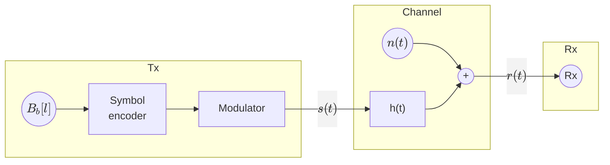
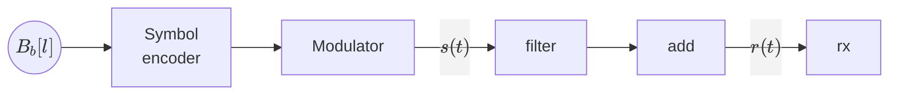

# Chapter 2: Linera modulations

* Base band modulations

## Base band modulations

Modulation needed to have a signal travel over base band channels.

Where $h(t)$ is a baseband filter. Therefore, we must design a signal $s(t)$ that can pass the
baseband filter $h(t)$.

* $s(t) = ∑_n ∑_{j=1}^N A_j[n] Φ_j(t-nT)$
* $N=1$
* $\bar{A}[n] = A[n]$ (1-D constellation)
* $Φ_1(t)$ needs to be a baseband signal

We will use **Baseband Pulse Amplitude Modulation (PAM)**, also called Baseband Amplitude Shift Keying (ASK)

* $g(t)$: **Shaping filter** or **transmit filter**
* $A[n]$: **Constellation** in 1D.  
  $A[n] ∈ \{±1, ±3, …, ±(M-1)\}$ (M-PAM)

### Example for $M=2$

$$
\begin{aligned}
    & A[n] ∈ \{-1, 1\} \\
    & B[n] ∈ \{b_1, b_2\} = \{"0", "1"\} \\
\end{aligned}
$$

### Example for $M=4$

$$
\begin{aligned}
    &  A[n] ∈ \{±1, ±3\} \\
    &  B[n] ∈ \{b_1, b_2, b_3, b_4\} = \{"00", "01", "10", "11"\} \\
\end{aligned}
$$

We must ensure to follow Grey coding, so adjacent symbols differ by only one bit:
