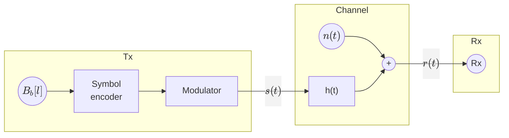
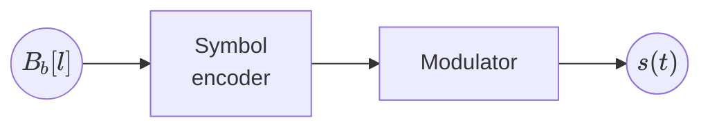
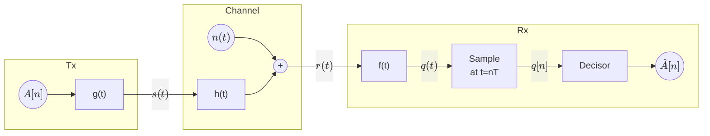
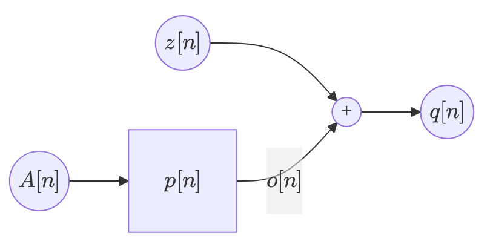
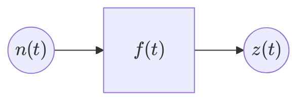

# Chapter 2: Linear modulations

* Baseband modulations

## Baseband modulations

Modulation needed to have a signal travel over baseband channels.

Where $h(t)$ is a baseband filter. Therefore, we must design a signal $s(t)$ that can pass the
baseband filter $h(t)$.

* $s(t) = ∑_n ∑_{j=1}^N A_j[n] Φ_j(t-nT)$
* $N=1$
* $\bar{A}[n] = A[n]$ (1-D constellation)
* $Φ_1(t)$ needs to be a baseband signal

We will use **Baseband Pulse Amplitude Modulation (PAM)**, also called Baseband Amplitude Shift Keying (ASK)

* $g(t)$: **Shaping filter** or **transmit filter**
* $A[n]$: **Constellation** in 1D.  
  $A[n] ∈ \{±1, ±3, …, ±(M-1)\}$ (M-PAM)

> **Example** for $M=2$
>
> $$
> \begin{aligned}
>     & A[n] ∈ \{-1, 1\} \\
>     & B[n] ∈ \{b_1, b_2\} = \{"0", "1"\} \\
> \end{aligned}
> $$
>
> **Example** for $M=4$
>
> $$
> A[n] ∈ \{±1, ±3\}
> $$
>
> We must ensure to follow Grey coding, so adjacent symbols differ by only one bit:
>
> $$
> \begin{aligned}
> B[n] ∈ \{b_1, &&b_2,  &&b_3,  &&b_4\}\\
>       \{"00", &&"01", &&"11", &&"10"\} \\
> \end{aligned}
> $$
>
> **Example** for $M=8$
>
> $$
> A[n] ∈ \{±1, ±3, ±5, ±7\}
> $$
>
> In order to follow Grey coding, we must have:
>
> $$
> \begin{aligned}
> B[n] ∈ \{b_1,   &&b_2,   &&b_3,   &&b_4,   &&b_5,   &&b_6,   &&b_7,   &&b_8\} \\
>        \{"000", &&"001", &&"011", &&"010", &&"110", &&"111", &&"101", &&"100"\}
> \end{aligned}
> $$

### Baseband PAM spectrum

$$
s(t) = ∑_n A[n] g(t-nT) → S_s(jω)
$$

Where $A[n]$ is a random sequence and $g(t)$ is a deterministic signal. This makes $s(t)$ a **random
process**, and we can find its **power spectral density** $S_s(jω)$. We will assume the probability
of each symbol is the same: $P(a_i) = {1 \over M}$.

$$
S_s(jω) = {1 \over T} S_A\left(e^{jωT}\right) \underbrace{|G(jω)|^2}_{=\mathcal{F}\{g(t)\}}
$$

Where $S_A(e^{jω})$ is the power spectral density of $A[n]$. Its expression is given by:

$$
S_A\left(e^{jω}\right) = ∑_k R_A[k] e^{-jωkT}
$$

Where $R_A[k]$ is the autocorrelation function of $A[n]$:

$$
R_A[k] = E\{A[n] A[n-k]\} = E_s \delta[k]
$$

In cases such as these where the autocorrelation funciton is a delta function, the sequence is
uncorrelated and it's called a white sequence. The value at $k=0$ is:

$$
R_A[0] = E\{A^2[n]\} = E_s = \frac{M^2-1}{3}
$$

So, in cases where $A[n]$ is a white sequence, the power spectral density of $A[n]$ is:

$$
S_s(jω) = \frac{E_s}{T} |G(jω)|^2
$$

By designing $g(t)$ so that $|G(jω)|^2$ is as close as possible to a rectangle that fits in
$|H(jω)|$, we can ensure that $s(t)$ can pass through the baseband filter $h(t)$ mostly unaffected.

Since a rectangular pulse signal has a fourier transform of $sinc(ωT)$, it is not bandlimited. We
will not use rectangular pulses as shaping filters.

### Nyquist criterion for bandlimited channels

The Nyquist criterion for bandlimited channels allows us to design the "best" $g(t)$ such that no
information is lost.

Our target $|G(jω)|$ is a rectangle that fits in $|H(jω)|$, where

$$
|H(jω)| = \begin{cases}
    1 & \text{if } |ω| ≤ W \\
    0 & \text{if } |ω| > W
\end{cases}
$$

Our $|G(jω)|$ will be the following rectangle:

$$
|G(jω)| = \begin{cases}
    A & \text{if } |ω| ≤ π R_s \\
    0 & \text{if } |ω| > π R_s
\end{cases}
$$

Where $π R_s = W$. This means our maximum symbol rate will be $R_s = \frac{W}{π}$

Here, $q(t)$ can be expressed as

$$
\begin{aligned}
    q(t) &= s(t) * h(t) * f(t) + \underbrace{n(t) * f(t)}_{\displaystyle z(t)} \\
    &= h(t) * f(t) * ∑_k A[k] g(t-kT) + z(t) \\
    &= ∑_k A[k] \big(h(t) * f(t) * g(t-kT)\big) + z(t) \\
\end{aligned}
$$

We'll define a new filter $p(t)$ and call it the equivalent channel:

$$
p(t) = g(t) * h(t) * f(t)
$$

Extracting the delay in $g(t)$ and applying it to the equivalent channel:

$$
q(t) = ∑_k = A[k] p(t-kT) + z(t)
$$

Sampling this signal at $t=nT$ provides us with the following expression of $q[n]$:

$$
q[n] = q(t) \big|_{t=nT} = ∑_k A[k] p(nT-kT) + z(nT)
$$

We can also define two discrete-time signals for the equivalent channel and the noise:

$$
\begin{align*}
    p[n] &= p(nT) \\
    z[n] &= z(nT)
\end{align*}
$$

And then arrive at the following expression for $q[n]$:

$$
\begin{align*}
    q[n] &= ∑_k A[k] p[n-k] + z[n] \\
    &= A[n] * p[n] + z[n]
\end{align*}
$$

This allows us to to rethink the channel as a discrete-time channel:

We should attempt to make $q[n]$ as similar as possible to $A[n]$.

We can also define $q[n]$ as this expression:

$$
q[n] = A[n] p[0] + ∑_{k≠n} A[k] p[n-k] + z[n] = A[n] p[0] + \underbrace{I[n]}_{ISI} + z[n]
$$

Using the nyquist theorem we can reduce the ISI (intersymbol interference $I[n]$) to zero. Note that
the noise $z[n]$ can not be removed, but we will also try to minimize it. These are our ideal conditions:

* $I[n] = 0$
* $E\{|z[n]|^2\} = σ_z^2 ↓$

### Nyquist criteria for zero ISI

In order to make $I[n] = 0$, we must have $p[n] = 0$ for $n ≠ 0$. This means that $p[n]$ must be a
delta function. This is stated in the **Nyquist criteria for zero ISI**.

$$
p[n] = p[0] δ[n] ⇒ q[n] = A[n] p[0] * δ[n] + z[n]
$$

The nyquist criteria can be stated in different domains:

| Domain              | Criteria                                                           |
| ------------------- | ------------------------------------------------------------------ |
| **Discrete time**   | $p[n] = δ[n]$                                                      |
| **Continuous time** | $p(t) · ∑_k δ(t-kT)= δ(t) · \text{const}$                          |
| **Frequency**       | $\frac{1}{T} ∑_k P\left(jω - \frac{2π}{T} k\right) = \text{const}$ |

> **Example** in continous time domain
>
> Let $p(t)$ be defined as follows:
>
> $$
> p(t) = \begin{cases}
>     -1 + \frac{|t|}{T} & \text{if } 0.5 T ≤ |t| ≤ T \\
>     1 - 3\frac{|t|}{T} & \text{if } 0 ≤ |t| ≤ 0.5 T \\
>     0 & \text{otherwise}
> \end{cases}
> $$
>
> If we sample $p(t)$ at $t=nT$, we get $p[n] = δ[n]$. This means that the ISI will be 0 with this
> $p(t)$.

In the **frequency domain**, $P(jω) = G(jω) · H(jω) · F(jω)$

> **Examples** in the frequency domain
>
> Let $P(jω)$ be the following function
>
> $$
> P(jω) = \begin{cases}
>     1 - \frac{|ω|}{W} \text{if } |ω| ≤ W \\
>     0 & \text{if } |ω| > W
> \end{cases}
> $$
>
> The following $P(jω)$ also satisfies the Nyquist criteria:
>
> $$
> P(jω) = \begin{cases}
>     1 & \text{if } |ω| ≤ W \\
>     0 & \text{if } |ω| > W
> \end{cases}
> $$
>
> So does this other $P(jω)$:
>
> $$
> P(jω) = \begin{cases}
>     1 & \text{if } |ω| ≤ α W \\
>     1- \frac{|ω| - αW}{W} & \text{if } α W ≤ |ω| ≤ W \\
>     0 & \text{if } |ω| > α W
> \end{cases}
> $$

#### Nyquist criteria in the discrete time domain

Then, we will try to design $g(t)$ and $f(t)$ such that

$$
p[n] = g(t) * h(t) * f(t) \big|_{t=nT} = δ[n]
$$

We'll split the search of $g(t)$ and $f(t)$ into two cases:

1. Assuming $h(t) = δ(t)$
2. Assuming $h(t) ≠ δ(t)$

Then, we'll inspect the effect on noise, focusing on its variance and whether or not it's white.

#### Case 1: $h(t) = δ(t)$

In this case, we have $p(t) = g(t) * f(t)$. We will assume that the receiver filter $f(t)$ is an
optimal matched filter: $f(t) = g(-t)$. This is the best and most common scenario.

In order to remove ISI, we will use the Nyquist criterion in the frequency domain. We will use the
fact that the Fourier Transform of the inverse signal is the complex conjugate of the Fourier
Transform, and that the Fourier Transform of a delta function is a constant.

$$
P(jω) = G(jω) · \underbrace{H(jω)}_{1} · F(jω) = G(jω) · G^*(jω) = |G(jω)|^2
$$

Let us now see the effect on noise. We will assume that the noise introduced is white. This means we
will be able to make decisions on a per-symbol basis.

$$
E\{n(t) n(t-kT)\} = σ_z^2 δ[k]
$$

However, this may not be the case for the noise at the output of the matched filter:

$$
E\{z(t) z(t-kT)\} = σ_z^2 f(t) * f(t-kT)
$$

Let's inspect what exactly happens to the noise

$$
z(t) = n(t) * f(t)
$$

If the PSD of the noise at the input it $S_n (jω)$, the PSD at the output is:

$$
S_z (jω) = S_n (jω) |F(jω)|^2
$$

Since the noise is white, $S_n (jω) = \frac{N_0}{2}$

$$
S_z (jω) = \frac{N_0}{2} |F(jω)|^2
$$

Here, $F(jω)$ will make this not constant, meaning that the noise $z(t)$ will not be white. However,
once we sample the signal, the noise may be white for our purposes. For this to be the case, the PSD
of the **discrete-time filtered noise** must be constant. Let's check:

$$
\begin{aligned}
    S_z (e^{jω}) &= \frac{N_0}{2} \left|F\left(jω - j \frac{2π}{T} k\right)\right|^2 \\
    &= \frac{N_0}{2}\frac{1}{T} \underbrace{∑_k \left|G\left(jω - j \frac{2π}{T} k \right)\right|^2}_{\text{constant}}
\end{aligned}
$$

The last term must be constant because that was our initial Nyquist criteria condition. Therefore,
the noise at the output of the matched filter **is white**.

#### Case 2: $h(t) ≠ δ(t)$

We do not know the exact shape of the channel filter $h(t)$. However, it is still a bandlimited
filter. In this case, the filter $f(t)$ is generic, and will have to be designed independently.

In the frequency domain, $P(jω) = G(jω) · H(jω) · F(jω)$.

##### 1st option: equalizer

Our first option is to redesign the receiver filter $f(t)$ to compensate for the channel filter
$h(t)$. This is called an **equalizer**.

$$
F(jω) = \frac{G^*(jω)}{H(jω)} ⇒\\
P(jω) = G(jω) · H(jω) · \frac{G^*(jω)}{H(jω)} = |G(jω)|^2
$$

Now, if we choose $|G(jω)|^2$ such that $∑_k \left|G\left(jω - j \frac{2π}{T}k\right) \right|^2 =
\text{const}$, we will have zero ISI. However, the noise will not be white:

$$
S_z(e^{j}) = \frac{N_0}{2} \frac{1}{T} \left|F\left(jω - j \frac{2π}{T}k\right)\right|^2 ≠ \text{const}
$$

##### 2nd option: pre-distortion
Our second option is to redesign the transmit filter $g(t)$ to compensate for the channel distortion. This is called **pre-distortion**.

$$
G(jω) = \frac{F^*(jω)}{H(jω)} ⇒\\
P(jω) = \frac{F^*(jω)}{H(jω)} · H(jω) · F(jω) = |F(jω)|^2
$$

Choosing $|F(jω)|^2$ such that $∑_k \left|F\left(jω - j \frac{2π}{T}k\right) \right|^2 =
\text{const}$ will also give us zero ISI. In this case, as the receiver filter is not modified, the
noise $z[n]$ will stay white.

##### 3rd option: ignore the channel

We may also choose to ignore the channel and design $g(t)$ and $f(t)$ as if $h(t) = δ(t)$, using a
matched filter at the receiver.

$$
\begin{aligned}
    &\frac{1}{T} ∑_k P(jω - j \frac{2π}{T}k) = \\
    &= \frac{1}{T} ∑_k G\left(jω - j \frac{2π}{T}k\right) · G^*\left(jω - j \frac{2π}{T}k\right)
        · H\left(jω - j \frac{2π}{T}k\right)\\
    &= \frac{1}{T} ∑_k \left|G\left(jω -j \frac{2π}{T}k\right)\right|^2
        · H\left(jω-j \frac{2π}{T}k\right) ≠ \text{const (generally)}
\end{aligned}
$$

Therefore, we will have ISI in most cases. However, the noise will be white.

> **Extra notes**: Real world channel estimation
>
> Updating a transmitted about the channel that it's about to transmit to constantly is a very
> expensive mode of operation. That's why the usual approach is to have the receiver adapt to the
> channel. The usual way to do this is to have the transmitter send a known sequence, called a
> "pilot sequence" ($A_p[n]$) that the receiver can use to estimate the effect of the channel upon
> receiving the distored pilot sequence.
>
> This is not usually done for every single transmission, but only periodically, and the channel is
> assumed to be constant for a certain period of time: this is called the **coherence time** of the
> channel.

### Real communication systems

Most real communication systems use matched filters $g(t)$ and $f(t)$ such that $G(jω) · F(jω)$ has
a **raised cosine pulse** shape. The raised cosine pulse occupies a bandwidth of $W = \frac{π}{T}
(1+α)$, where $α$ is the roll-off factor ($0 ≤ α ≤ 1$)
