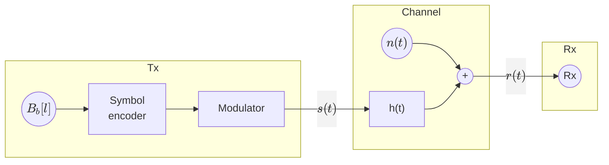
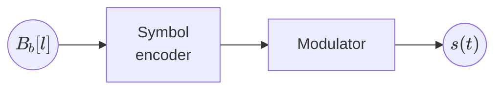

# Chapter 2: Linera modulations

* Base band modulations

## Base band modulations

Modulation needed to have a signal travel over base band channels.

Where $h(t)$ is a baseband filter. Therefore, we must design a signal $s(t)$ that can pass the
baseband filter $h(t)$.

* $s(t) = ∑_n ∑_{j=1}^N A_j[n] Φ_j(t-nT)$
* $N=1$
* $\bar{A}[n] = A[n]$ (1-D constellation)
* $Φ_1(t)$ needs to be a baseband signal

We will use **Baseband Pulse Amplitude Modulation (PAM)**, also called Baseband Amplitude Shift Keying (ASK)

* $g(t)$: **Shaping filter** or **transmit filter**
* $A[n]$: **Constellation** in 1D.  
  $A[n] ∈ \{±1, ±3, …, ±(M-1)\}$ (M-PAM)

> **Example** for $M=2$
>
> $$
> \begin{aligned}
>     & A[n] ∈ \{-1, 1\} \\
>     & B[n] ∈ \{b_1, b_2\} = \{"0", "1"\} \\
> \end{aligned}
> $$
>
> **Example** for $M=4$
>
> $$
> A[n] ∈ \{±1, ±3\}
> $$
>
> We must ensure to follow Grey coding, so adjacent symbols differ by only one bit:
>
> $$
> \begin{aligned}
> B[n] ∈ \{b_1, &&b_2,  &&b_3,  &&b_4\}\\
>       \{"00", &&"01", &&"11", &&"10"\} \\
> \end{aligned}
> $$
>
> **Example** for $M=8$
>
> $$
> A[n] ∈ \{±1, ±3, ±5, ±7\}
> $$
>
> In order to follow Grey coding, we must have:
>
> $$
> \begin{aligned}
> B[n] ∈ \{b_1,   &&b_2,   &&b_3,   &&b_4,   &&b_5,   &&b_6,   &&b_7,   &&b_8\} \\
>        \{"000", &&"001", &&"011", &&"010", &&"110", &&"111", &&"101", &&"100"\}
> \end{aligned}
> $$

### Base band PAM spectrum

$$
s(t) = ∑_n A[n] g(t-nT) → S_s(jω)
$$

Where $A[n]$ is a random sequence and $g(t)$ is a deterministic signal. This makes $s(t)$ a **random
process**, and we can find its **power spectral density** $S_s(jω)$. We will assume the probability
of each symbol is the same: ($P(a_i) = {1 \over M}$).

$$
S_s(jω) = {1 \over T} S_A\left(e^{jωT}\right) \underbrace{|G(jω)|^2}_{=\mathcal{F}\{g(t)\}}
$$

Where $S_A(e^{jω})$ is the power spectral density of $A[n]$. Its expression is given by:

$$
S_A\left(e^{jω}\right) = ∑_k R_A[k] e^{-jωkT}
$$

Where $R_A[k]$ is the autocorrelation function of $A[n]$:

$$
R_A[k] = E\{A[n] A[n-k]\} = E_s \delta[k]
$$

In cases such as these where the autocorrelation funciton is a delta function, the sequence is
uncorrelated and it's called a white sequence.
