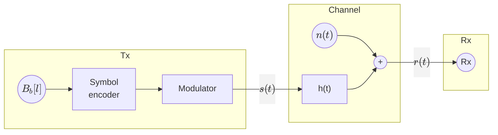
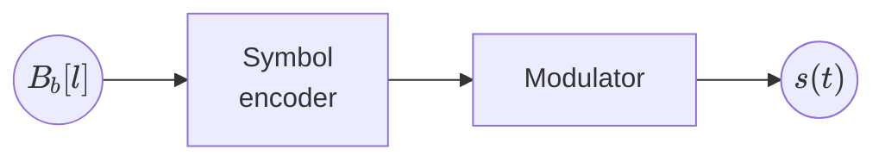
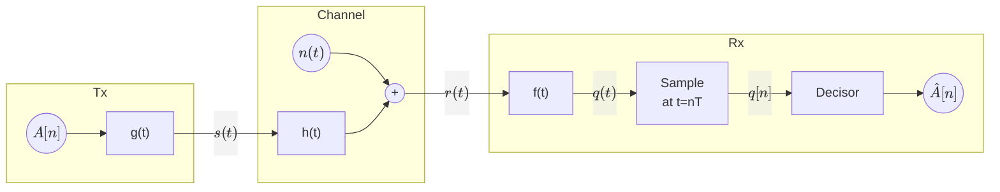
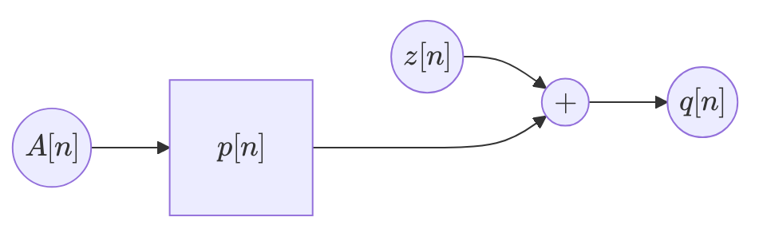

# Chapter 2: Linera modulations

* Baseband modulations

## Baseband modulations

Modulation needed to have a signal travel over baseband channels.

Where $h(t)$ is a baseband filter. Therefore, we must design a signal $s(t)$ that can pass the
baseband filter $h(t)$.

* $s(t) = ∑_n ∑_{j=1}^N A_j[n] Φ_j(t-nT)$
* $N=1$
* $\bar{A}[n] = A[n]$ (1-D constellation)
* $Φ_1(t)$ needs to be a baseband signal

We will use **Baseband Pulse Amplitude Modulation (PAM)**, also called Baseband Amplitude Shift Keying (ASK)

* $g(t)$: **Shaping filter** or **transmit filter**
* $A[n]$: **Constellation** in 1D.  
  $A[n] ∈ \{±1, ±3, …, ±(M-1)\}$ (M-PAM)

> **Example** for $M=2$
>
> $$
> \begin{aligned}
>     & A[n] ∈ \{-1, 1\} \\
>     & B[n] ∈ \{b_1, b_2\} = \{"0", "1"\} \\
> \end{aligned}
> $$
>
> **Example** for $M=4$
>
> $$
> A[n] ∈ \{±1, ±3\}
> $$
>
> We must ensure to follow Grey coding, so adjacent symbols differ by only one bit:
>
> $$
> \begin{aligned}
> B[n] ∈ \{b_1, &&b_2,  &&b_3,  &&b_4\}\\
>       \{"00", &&"01", &&"11", &&"10"\} \\
> \end{aligned}
> $$
>
> **Example** for $M=8$
>
> $$
> A[n] ∈ \{±1, ±3, ±5, ±7\}
> $$
>
> In order to follow Grey coding, we must have:
>
> $$
> \begin{aligned}
> B[n] ∈ \{b_1,   &&b_2,   &&b_3,   &&b_4,   &&b_5,   &&b_6,   &&b_7,   &&b_8\} \\
>        \{"000", &&"001", &&"011", &&"010", &&"110", &&"111", &&"101", &&"100"\}
> \end{aligned}
> $$

### Baseband PAM spectrum

$$
s(t) = ∑_n A[n] g(t-nT) → S_s(jω)
$$

Where $A[n]$ is a random sequence and $g(t)$ is a deterministic signal. This makes $s(t)$ a **random
process**, and we can find its **power spectral density** $S_s(jω)$. We will assume the probability
of each symbol is the same: $P(a_i) = {1 \over M}$.

$$
S_s(jω) = {1 \over T} S_A\left(e^{jωT}\right) \underbrace{|G(jω)|^2}_{=\mathcal{F}\{g(t)\}}
$$

Where $S_A(e^{jω})$ is the power spectral density of $A[n]$. Its expression is given by:

$$
S_A\left(e^{jω}\right) = ∑_k R_A[k] e^{-jωkT}
$$

Where $R_A[k]$ is the autocorrelation function of $A[n]$:

$$
R_A[k] = E\{A[n] A[n-k]\} = E_s \delta[k]
$$

In cases such as these where the autocorrelation funciton is a delta function, the sequence is
uncorrelated and it's called a white sequence. The value at $k=0$ is:

$$
R_A[0] = E\{A^2[n]\} = E_s = \frac{M^2-1}{3}
$$

So, in cases where $A[n]$ is a white sequence, the power spectral density of $A[n]$ is:

$$
S_s(jω) = \frac{E_s}{T} |G(jω)|^2
$$

By designing $g(t)$ so that $|G(jω)|^2$ is as close as possible to a rectangle that fits in
$|H(jω)|$, we can ensure that $s(t)$ can pass through the baseband filter $h(t)$ mostly unaffected.

Since a rectangular pulse signal has a fourier transform of $sinc(ωT)$, it is not bandlimited. We
will not use rectangular pulses as shaping filters.

### Nyquist criterion for bandlimited channels

The Nyquist criterion for bandlimited channels allows us to design the "best" $g(t)$ such that no
information is lost.

Our target $|G(jω)|$ is a rectangle that fits in $|H(jω)|$, where

$$
|H(jω)| = \begin{cases}
    1 & \text{if } |ω| ≤ W \\
    0 & \text{if } |ω| > W
\end{cases}
$$

Our $|G(jω)|$ will be the following rectangle:

$$
|G(jω)| = \begin{cases}
    A & \text{if } |ω| ≤ π R_s \\
    0 & \text{if } |ω| > π R_s
\end{cases}
$$

Where $π R_s = W$. This means our maximum symbol rate will be $R_s = \frac{W}{π}$

Here, $q(t)$ can be expressed as

$$
\begin{aligned}
    q(t) &= s(t) * h(t) * f(t) + \underbrace{n(t) * f(t)}_{\displaystyle z(t)} \\
    &= h(t) * f(t) * ∑_k A[k] g(t-kT) + z(t) \\
    &= ∑_k A[k] \big(h(t) * f(t) * g(t-kT)\big) + z(t) \\
\end{aligned}
$$

We'll define a new filter $p(t)$ and call it the equivalent channel:

$$
p(t) = g(t) * h(t) * f(t)
$$

Extracting the delay in $g(t)$ and applying it to the equivalent channel:

$$
q(t) = ∑_k = A[k] p(t-kT) + z(t)
$$

Sampling this signal at $t=nT$ provides us with the following expression of $q[n]$:

$$
q[n] = q(t) \big|_{t=nT} = ∑_k A[k] p(nT-kT) + z(nT)
$$

We can also define two discrete-time signals for the equivalent channel and the noise:

$$
\begin{align*}
    p[n] &= p(nT) \\
    z[n] &= z(nT)
\end{align*}
$$

And then arrive at the following expression for $q[n]$:

$$
\begin{align*}
    q[n] &= ∑_k A[k] p[n-k] + z[n] \\
    &= A[n] * p[n] + z[n]
\end{align*}
$$

This allows us to to rethink the channel as a discrete-time channel:

We should attempt to make $q[n]$ as similar as possible to $A[n]$.

We can also define $q[n]$ as this expression:

$$
q[n] = A[n] p[0] + \underbrace{∑_{k≠n} A[k] p[n-k]}_{ISI} + z[n]
$$

Using the nyquist theorem we can reduce the ISI (Intersymbol interference) to zero.
