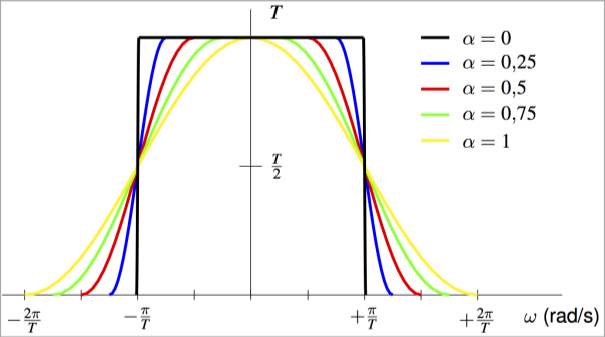

<style>
body {
    column-count: 2;
    column-gap: 2em;
    column-rule: 1px solid gray;
}
@media print {
    body {
        font-size: 9pt;
        padding: 1em 0 0.2em;
    }
}
h1, h2, h3, h4, h5, h6 {
    break-after: avoid;
}
h1, h2, h3 {
    font-variant: small-caps;
    column-span: all;
}
h1, h2 { text-align: center; }

h1 {
    margin-bottom: 0;
}
h2 {
    margin-top: 0.4em;
    margin-bottom: 0.2em;
}
h3 {
    margin-top: 0.4em;
    margin-bottom: 0.2em;
    border-bottom: 0.96px dashed rgba(128, 128, 128, 0.5);
}
h4 {
    margin-top: 0.1em;
    margin-bottom: -0.3em;
}
h5 {
    margin-top: 0.5em;
    margin-bottom: -0.4em;
    font-style: italic;
}

p {
    margin-top: 0.1em;
    margin-bottom: 0.1em;
    break-before: avoid;
    break-inside: avoid;
}
ul {
    margin-top: 0.6em;
}
li {
    break-before: avoid;
    break-inside: avoid
}
table {
    margin-left: auto;
    margin-right: auto;
    break-before: avoid;
    break-inside: avoid
}
.katex .katex-html>.newline {
    height: 0.2rem;
}
.pagebreak {
    column-span: all;
    border: none;
    break-after: page;
}

/* This allows me to put a code span or equation spanning all columns */
blockquote:has(> * > * > .katex),
blockquote:has(> pre):not(:has(> *:not(pre))) {
    column-span: all;
    border: none;
    background: transparent;
}
</style>

# Digital Communications - Final Exam Formulas

## General

$$
P_e ≈ κ Q\left(\frac{d_{min}}{2σ_n}\right)
$$

$$
W \left[\tfrac{\text{rad}}{\text{s}}\right] = 2π ⋅ B \text{ [Hz]}
$$

#### Tx rates

$$
R_s = \tfrac{1}{T}; \qquad
R_b = m R_s \\
m = \log_2 M \\
$$

## Chapter 2. Linear Modulations

> ```mermaid
> %%{init: {'forceLegacyMathML':'true'} }%%
> flowchart LR
> 
> A(("$$A[n]$$"))
> 
> subgraph p_ ["p[n]"]
>     subgraph p ["p(t)"]
>         g["$$g(t)$$"]
>         subgraph bp ["(Bandpass)"]
>             carr_in(["$$\sqrt{2}e^{jω_ct}$$"]) --> bp_mult(("$$\times$$"))
>             re["$$\R\{⋅\}$$"]
>             carr_out(["$$\sqrt{2}e^{-jω_ct}$$"]) --> bb_mult(("$$\times$$"))
>         end
>         h["$$h(t)$$"]
>         awgn(("$$+$$"))
>         f["$$f(t)$$"]
>     end
>     sampl["Sampling <br/> t=nT"]
> end
> 
> dec[Decisor]
> A_(("$$\hat{A}[n]$$"))
> 
> A --> g
> g -."$$s(t) \;$$ (BB)".-> h
> g --"$$s(t)$$"--> bp_mult --> re --"$$x(t)$$"--> h
> h --> awgn
> awgn -."$$r(t) \;$$ (BB)".-> f
> awgn --"$$y(t)$$"--> bb_mult --"$$r(t)$$"-->
> f --"$$q(t)$$"--> sampl --"$$q[n]$$"--> dec --> A_
> 
> n(("$$n(t)$$")) --> awgn
> ```

### Baseband

#### BB Equivalent channel

$$
p(t) = g(t) * h(t) * f(t); \qquad
p[n] = p(t) \big|_{t=nT} \\
P(jω) = G(jω) ⋅ H(jω) ⋅ F(jω)
$$

$$
q(t) = \big(A[n] * g(t) * h(t) + n(t)\big) * f(t)\\
q[n] = q(t) \big|_{t=nT} = \underbrace{A[n] * p[n]}_{o[n]}
    + \underbrace{n(t) * f(t) \big|_{t=nT}}_{z[n]} \\
$$

#### BB signal PSD

$$
\begin{aligned}
    S_A(jω) &= ∑_k R_A[k] e^{-jωkT}\\
    S_s(jω) &= \tfrac{1}{T} S_A(e^{jωT}) |G(jω)|^2
\end{aligned}
$$

#### Nyquist criteria for zero ISI

$$
p[n] = p(t) \big|_{t = nT} ∝ δ[n] \\[0.3em]
∑_k P\left(jω - \tfrac{2π}{T} k\right) = \text{const}
$$

#### Raised Cosine Filter $H_{RC}^{α,T} (jω)$



* **Satisfies Nyquist criteria $⟹ ∄$ ISI**
* Bandwidth: $W = \frac{2π}{T}(1+α)$
* Target: $P(jω) = H_{RC}^{a,T} (jω)$
    * Matched filters $⟹$ SR-RCF: $\\ G(jω) = \sqrt{H_{RC}^{a,T}(jω)}$

### Bandpass

#### BP signal PSD

$$
S_x(jω) = \tfrac{1}{2} (S_s(jω-jω_c) + S_s^*(-jω-jω_c))
$$

#### BP noise PSD

$$
\begin{aligned}
    S_z(jω) &= S_n(jω) |F(jω)|^2 \\
    S_z(e^{jω}) &= \tfrac{1}{T} S_n(jω)
        ∑_k \left|F\left(j \tfrac{ω}{T} + j \tfrac{2π}{T}k\right)\right|^2
\end{aligned}
$$

<hr class="pagebreak"/>

## Chapter 3. Intersymbol Interference

$$
\bar{A} = \Big[A[0], …, A[L-1]\Big] \\
p[n] = p[0] δ[n] + … + p[L_p]δ[n-L_p]
$$

####

$$
\bar{q} = \Big[q[0], … q[L_q-1]\Big]; \quad
L_q = L + L_p
$$

* Output sequence depends on $L_p$ past and $L_p$ future symbols of $\bar{A}$
  (side information)

### Symbol-by-symbol detector

* $q[n] → \hat{A}[n-d];\quad d = \arg\max_n |p[n]|$
* Decision regions

#### SBSD error probability with ISI

$$
P_e = ∑_k p(A[n-d]=a_k) ⋅ P_e|_{A[n-d]=a_k}
    \overset{\clap{AWGN}}{≈} Q\left(\frac{d_{min}^{o[n]}}{2σ_z}\right)
$$

### Maximum Likelihood Sequence Detector

* $\bar{q} ⟹ \hat{\bar{A}}$
* $\arg\min_i d(\bar{q}, \bar{o}_i)$ or Viterbi algorithm

#### Trellis diagram

* Rows are states $ψ_i$ ($M^{L_p}$ states)
    * $ψ_i[n] = \Big[A_i[n-1], …, A_i[n-L_p\Big]$
* Branches ($M$ in, $M$ out): label `A[n] | o[n]`

#### Viterbi algorithm via Trellis

* Trellis of length $L_q$
* Branches: label metric $|q[n] - o[n]|^2$
* Nodes: label accumulated metric

#### MLSD error probability

$$
P_e ≈ Q\left(\frac{D_{min}^{\bar{o}}}{2σ_z}\right); \quad
D_{min} = \min_i d(\bar{o}_{ref}, \bar{o}_i)
$$

### Equalizer


$$
u[n] = A[n] * \underbrace{p[n] * w[n]}_{c[n]} + \underbrace{z[n]*w[n]}_{z'[n]}
$$

#### Equalizer error probabilities

$$
P_e ≈ Q\left(\frac{|c[d]| D_{min}^{A[n-d]}}{2\sqrt{σ^2_{z'} + σ^2_{ISI}}}\right)
$$

$$
\begin{aligned}
    & σ^2_{z'_{ZFu}}   &&= \frac{σ^2_z}{2π} ∫_{-π}^π \frac{dω}{|P(e^{jω})|^2}\\
    & σ^2_{z'_{MMSEu}} &&= \frac{σ^2_z}{2π}
        ∫_{-π}^π \frac{dω}{|P(e^{jω})|^2 + \frac{σ^2_z}{E_s}}\\
    & σ^2_{z'_{c}}     &&= σ^2_z ∑_k |w[k]|^2 \\
    & σ^2_{ISI} &&= E_s ∑_{k≠d} |c[k]|^2 \quad
        \overset{\text{[unconstr.]}}{=} 0
\end{aligned}
$$

#### Unconstrained Equalizers

* Zero-forcing $⟹c[n] ∝ δ[n-d]$

$$
\begin{aligned}
    W_{\text{ZFu}} (e^{jω}) &= \frac{e^{jωd}}{P(e^{jω})} \\
    W_{\text{MMSEu}} (e^{jω})
        &= \frac{e^{-jωd} P^*(e^{jω})}{|P(e^{jω})|^2 + \frac{σ^2_z}{E_s}}
\end{aligned}
$$

#### Constrained ZF or MMSE Equalizers

* $w[n]$ limited to $L_w+1$ coefficients

$$
\underbrace{
\begin{bmatrix}
    c_d[0] \\
    ⋮ \\
    c_d[d] \\
    ⋮ \\
    c_d[L_p + L_w]
\end{bmatrix}
}_{\overline{C}_{d \; (L_p+L_w+1×1)}}
=
\underbrace{
\begin{bmatrix}
    p[0]   & 0        & \cdots & 0 \\
    p[1]   & p[0]     & \cdots & 0 \\
    \vdots & \vdots   & \ddots & \vdots \\
    p[L_p] & p[L_p-1] & \cdots & p[0] \\
    \vdots & \vdots   & \ddots & \vdots \\
    0      & 0        & \cdots & p[L_p] \\
\end{bmatrix}
}_{\overline{\overline{P}}_{(L_p+L_w+1×L_w+1)}}
\underbrace{
\begin{bmatrix}
    w[0] \\
    ⋮ \\
    w[L_w]
\end{bmatrix}
}_{\overline{W}_{(L_w+1×1)}}
$$

$$
\overline{W}_{\text{c}}
    = \mathrm{pinv} \left(\overline{\overline{P}}\right) \overline{C}_d; \quad
    c_d[n] = δ[n-d]
$$

<hr class="pagebreak" />
