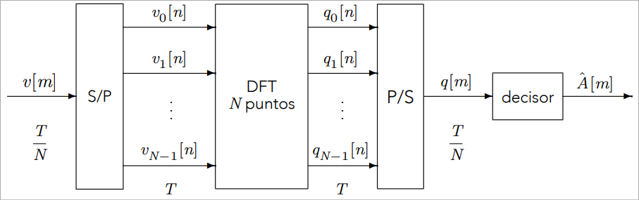

<style>
body {
    column-count: 2;
    column-gap: 2em;
    column-rule: 1px solid gray;
}
@media print {
    body {
        font-size: 9pt;
        padding: 1em 0 0.2em;
    }
}
h1, h2, h3, h4, h5, h6 {
    break-after: avoid;
}
h1, h2, h3 {
    font-variant: small-caps;
    column-span: all;
}
h1, h2 { text-align: center; }

h1 {
    margin-bottom: 0;
}
h2 {
    margin-top: 0.4em;
    margin-bottom: 0.2em;
}
h3 {
    margin-top: 0.4em;
    margin-bottom: 0.2em;
    border-bottom: 0.96px dashed rgba(128, 128, 128, 0.5);
}
h4 {
    margin-top: 0.1em;
    margin-bottom: -0.3em;
}
h5 {
    margin-top: 0.5em;
    margin-bottom: -0.4em;
    font-style: italic;
}

p {
    margin-top: 0.1em;
    margin-bottom: 0.1em;
    break-before: avoid;
    break-inside: avoid;
}
ul {
    margin-top: 0.6em;
}
li {
    break-before: avoid;
    break-inside: avoid
}
table {
    margin-left: auto;
    margin-right: auto;
    break-before: avoid;
    break-inside: avoid
}
.katex .katex-html>.newline {
    height: 0.2rem;
}

.colbreak {
    column-span: all;
    margin: 1px 0;
    padding: 0;
    border: none;
}

.pagebreak {
    column-span: all;
    break-after: page;
    margin: 0;
    padding: 0;
    border: none;
}

/* This allows me to put a code span or equation spanning all columns */
blockquote:has(> * > * > .katex),
blockquote:has(> pre):not(:has(> *:not(pre))) {
    column-span: all;
    border: none;
    background: transparent;
}
</style>

# Digital Communications - Final Exam Formulas

## General

$$
P_e ≈ κ Q\left(\frac{d_{min}}{2σ_n}\right)
$$

$$
W \left[\tfrac{\text{rad}}{\text{s}}\right] = 2π ⋅ B \text{ [Hz]}
$$

#### Tx rates

$$
R_s = \tfrac{1}{T}; \qquad
R_b = m R_s \\
m = \log_2 M \\
$$

## Chapter 2. Linear Modulations

> ```mermaid
> %%{init: {'forceLegacyMathML':'true'} }%%
> flowchart LR
> 
> A(("$$A[n]$$"))
> 
> subgraph p_ ["p[n]"]
>     subgraph p ["p(t)"]
>         g["$$g(t)$$"]
>         h_bb["$$h(t)$$"]
>
>         subgraph h_eq ["$$h_{eq}(t) \quad$$ (Bandpass)"]
>             carr_in(["$$\sqrt{2}e^{jω_ct}$$"])   --> upmod(("$$\times$$"))
>             carr_out(["$$\sqrt{2}e^{-jω_ct}$$"]) --> downmod(("$$\times$$"))
>             re["$$\R\{⋅\}$$"]
>             h_bp["$$h(t)$$"]
>             awgn_bp(("$$+$$"))
>         end
>
>         awgn_bb(("$$+$$"))
>         f["$$f(t)$$"]
>     end
>     sampl["Sampling <br/> t=nT"]
> end
> 
> dec[Decisor]
> A_(("$$\hat{A}[n]$$"))
> 
> A --> g
> g -."$$s(t) \;$$ (BB)".-> h_bb --> awgn_bb -."$$r(t)$$".-> f
> g -."$$s(t) \;$$ (BP)".-> upmod --> re --"$$x(t)$$"--> h_bp -->
>     awgn_bp --"$$y(t)$$"--> downmod -."$$r(t)$$".-> f
> f --"$$q(t)$$"--> sampl --"$$q[n]$$"--> dec --> A_
> 
> n(("$$n(t)$$")) -.-> awgn_bb & awgn_bp
> ```

### Baseband

#### BB Equivalent channel

$$
p(t) = g(t) * h(t) * f(t); \qquad
p[n] = p(t) \big|_{t=nT} \\
P(jω) = G(jω) ⋅ H(jω) ⋅ F(jω)
$$

$$
q(t) = \big(A[n] * g(t) * h(t) + n(t)\big) * f(t)\\
q[n] = q(t) \big|_{t=nT} = \underbrace{A[n] * p[n]}_{o[n]}
    + \underbrace{n(t) * f(t) \big|_{t=nT}}_{z[n]} \\
$$

#### BB signal PSD

$$
\begin{aligned}
    S_A(jω) &= ∑_k R_A[k] e^{-jωkT}\\
    S_s(jω) &= \tfrac{1}{T} S_A(e^{jωT}) |G(jω)|^2
\end{aligned}
$$

#### Nyquist criteria for zero ISI

$$
p[n] = p(t) \big|_{t = nT} ∝ δ[n] \\[0.3em]
∑_k P\left(jω - \tfrac{2π}{T} k\right) = \text{const}
$$

#### Raised Cosine Filter $H_{RC}^{α,T} (jω)$


* **Satisfies Nyquist criteria $⟹ ∄$ ISI**
* Bandwidth: $W = \frac{2π}{T}(1+α)$
* Target: $P(jω) = H_{RC}^{a,T} (jω)$
    * Matched filters $⟹$ SR-RCF: $\\ G(jω) = \sqrt{H_{RC}^{a,T}(jω)}$

### Bandpass

#### BP signal PSD

$$
S_x(jω) = \tfrac{1}{2} (S_s(jω-jω_c) + S_s^*(-jω-jω_c))
$$

#### BP noise PSD

$$
\begin{aligned}
    S_z(jω) &= S_n(jω) |F(jω)|^2 \\
    S_z(e^{jω}) &= \tfrac{1}{T} S_n(jω)
        ∑_k \left|F\left(j \tfrac{ω}{T} + j \tfrac{2π}{T}k\right)\right|^2
\end{aligned}
$$

<hr class="pagebreak"/>

## Chapter 3. Intersymbol Interference

$$
\bar{A} = \Big[A[0], …, A[L-1]\Big] \\
p[n] = p[0] δ[n] + … + p[L_p]δ[n-L_p]
$$

####

$$
\bar{q} = \Big[q[0], … q[L_q-1]\Big]; \quad
L_q = L + L_p
$$

* Output sequence depends on $L_p$ past and $L_p$ future symbols of $\bar{A}$
  (side information)

### Symbol-by-symbol detector

* $q[n] → \hat{A}[n-d];\quad d = \arg\max_n |p[n]|$
* Decision regions

#### SBSD error probability with ISI

$$
P_e = ∑_k p(A[n-d]=a_k) ⋅ P_e|_{A[n-d]=a_k}
    \overset{\clap{AWGN}}{≈} Q\left(\frac{d_{min}^{o[n]}}{2σ_z}\right)
$$

### Maximum Likelihood Sequence Detector

* $\bar{q} ⟹ \hat{\bar{A}}$
* $\arg\min_i d(\bar{q}, \bar{o}_i)$ or Viterbi algorithm

#### Trellis diagram

* Rows are states $ψ_i$ ($M^{L_p}$ states)
    * $ψ_i[n] = \Big[A_i[n-1], …, A_i[n-L_p\Big]$
* Branches ($M$ in, $M$ out): label `A[n] | o[n]`

#### Viterbi algorithm via Trellis

* Trellis of length $L_q$
* Branches: label metric $|q[n] - o[n]|^2$
* Nodes: label accumulated metric

#### MLSD error probability

$$
P_e ≈ Q\left(\frac{D_{min}^{\bar{o}}}{2σ_z}\right); \quad
D_{min} = \min_i d(\bar{o}_{ref}, \bar{o}_i)
$$

### Equalizer


$$
u[n] = A[n] * \underbrace{p[n] * w[n]}_{c[n]} + \underbrace{z[n]*w[n]}_{z'[n]}
$$

#### Equalizer error probabilities

$$
P_e ≈ Q\left(\frac{|c[d]| D_{min}^{A[n-d]}}{2\sqrt{σ^2_{z'} + σ^2_{ISI}}}\right)
$$

$$
\begin{aligned}
    & σ^2_{z'_{ZFu}}   &&= \frac{σ^2_z}{2π} ∫_{-π}^π \frac{dω}{|P(e^{jω})|^2}\\
    & σ^2_{z'_{MMSEu}} &&= \frac{σ^2_z}{2π}
        ∫_{-π}^π \frac{dω}{|P(e^{jω})|^2 + \frac{σ^2_z}{E_s}}\\
    & σ^2_{z'_{c}}     &&= σ^2_z ∑_k |w[k]|^2 \\
    & σ^2_{ISI} &&= E_s ∑_{k≠d} |c[k]|^2 \quad
        \overset{\text{[unconstr.]}}{=} 0
\end{aligned}
$$

#### Unconstrained Equalizers

* Zero-forcing $⟹c[n] ∝ δ[n-d]$

$$
\begin{aligned}
    W_{\text{ZFu}} (e^{jω}) &= \frac{e^{jωd}}{P(e^{jω})} \\
    W_{\text{MMSEu}} (e^{jω})
        &= \frac{e^{-jωd} P^*(e^{jω})}{|P(e^{jω})|^2 + \frac{σ^2_z}{E_s}}
\end{aligned}
$$

#### Constrained ZF or MMSE Equalizers

* $w[n]$ limited to $L_w+1$ coefficients

$$
\underbrace{
\begin{bmatrix}
    c_d[0] \\
    ⋮ \\
    c_d[d] \\
    ⋮ \\
    c_d[L_p + L_w]
\end{bmatrix}
}_{\overline{C}_{d \; (L_p+L_w+1×1)}}
=
\underbrace{
\begin{bmatrix}
    p[0]   & 0        & \cdots & 0 \\
    p[1]   & p[0]     & \cdots & 0 \\
    \vdots & \vdots   & \ddots & \vdots \\
    p[L_p] & p[L_p-1] & \cdots & p[0] \\
    \vdots & \vdots   & \ddots & \vdots \\
    0      & 0        & \cdots & p[L_p] \\
\end{bmatrix}
}_{\overline{\overline{P}}_{(L_p+L_w+1×L_w+1)}}
\underbrace{
\begin{bmatrix}
    w[0] \\
    ⋮ \\
    w[L_w]
\end{bmatrix}
}_{\overline{W}_{(L_w+1×1)}}
$$

$$
\overline{W}_{\text{c}}
    = \mathrm{pinv} \left(\overline{\overline{P}}\right) \overline{C}_d; \quad
    c_d[n] = δ[n-d] \\
    \mathrm{pinv} (A) = A^+ \stackrel{\text{[LI columns]}}{=} (A^* A)^{-1} A^*
$$

<hr class="pagebreak" />

## Chapter 5. Multipulse Modulation

### Spread Spectrum (time division, frequency expansion)

> ```mermaid
> %%{init: {'forceLegacyMathML':'true'} }%%
> flowchart LR
> A(["$$A[n]$$"])
> subgraph p ["$$p[n]$$"]
> upsample["$$\uparrow N$$"]
> w["$$w_N[m]$$"]
> seq(["$$\tilde{x}[n]$$"]) --> seq_mult(("$$\times$$"))
> 
> subgraph d_ ["d[n]"]
> subgraph d ["$$d(t)$$"]
> gc["$$g_c(t)$$"]
> heq[["$$h_{eq}(t)$$"]]
> n_add(("$$+$$"))
> rcv_fc["$$g_c(-t)$$"]
> end
> sample["Sampl. $$\,t=mT_c$$"]
> end
> 
> seq_(["$$\tilde{x}^*[m]$$"])
> seq__mult(("$$\times$$"))
> rcv_w["$$w_N[-m]$$"]
> downsample["$$\downarrow N$$"]
> end
> noise_(["$$\sqrt{2}e^{-jω_ct}n(t)$$"]) --> n_add
> q(["$$q[n]$$"])
> 
> A --> upsample --> w --> seq_mult
> seq_mult --"$$s[m]$$"--> gc --"$$s(t)$$"--> heq --"$$y(t)$$"--> n_add --"$$r(t)$$"--> rcv_fc
> rcv_fc --"$$v(t)$$"--> sample
> sample --"$$v[m]$$"--> seq__mult --> rcv_w --> downsample --> q
> 
> seq_ --> seq__mult
> ```

* $A[n]$ transmitted $N$ times in $T$, once per $T_c$

$$
T_c = \tfrac{T}{N}
$$

#### SS Equivalent channel

$$
p[n] = ∑_{m=0}^{N-1} ∑_{l=0}^{N-1} x[m] x^*[l] d[nN + l - m]
$$

<hr class="colbreak" />

#### Spreading with $x[m]$

$$
\tilde{x}[m] = x [m \text{ mod } N];\quad
s[m] = A\left[\left⌊\tfrac{m}{N}\right⌋\right] \tilde{x}[m]
$$

#### SS Shaping

$$
g(t) = ∑_{m=0}^{N-1} x[m] g_c(t-mT_c) \\
s(t) = ∑_n ∑_{m=0}^{N-1} A[n] x[m] g_c(t-mT_c - nT) \\
$$

#### SS Reception — Despreading

$$
q[n] = ∑_{m=0}^{N-1} x^*[m]v[m+nN]
$$

#### SS Energy

$$
S_s(jω) = \tfrac{1}{T} \underbrace{S_A(e^{jωT})}_{E_s} |G(jω)|^2
    \underbrace{\left|∑_{m=0}^{N-1}x[m]e^{-jωmT_c}\right|^2}_{S_x{e^{jωT_c}}}
$$

### Multicarrier Modulation – Orthogonal Frequency-Division Multiplexing (OFDM)

* $A[m]$ transmitted through $N$ channels, $N$ symbols at a time.

$$
R_{s; \text{ ch. }k} ≤ B_k = \tfrac{B}{N}
$$

#### OFDM Modulator


<p class="caption"></p> <!-- Cancels image bottom margin -->

$$
s(t) = ∑_{k=0}^{N-1} s_k(t) = ∑_{k=0}^{N-1} A_k[n] ϕ_k(t-nT)
$$

#### OFDM Demodulator


<p class="caption"></p> <!-- Cancels image bottom margin -->

$$
\begin{aligned}
    q_k[n] &= ∑_{i=0}^{N-1} A_i[n] * p_{k,i}[n] + z[n]\\
    &\;\big\downarrow \; p_{k,i}[n] = δ[n] δ[i-k] \\
    &= \tfrac{N}{T} D[k] A_k[n] + z[n] \\
\end{aligned}
$$

<hr class="colbreak" />

#### OFDM Noise and error

$$
D[k] = \text{DFT}\{d[n]\} \\
SNR = \frac{\left(\frac{N}{T}\right)^2 |D[k]|^2 E_s}{σ_z^2} \\
P_e^{(k)} ≈ Q\left(\frac{\frac{N}{T}|D[k]| d_{min}^{A[n]}}{2σ_z}\right) \\
$$

#### OFDM Energy

$$
\text{Uncorr. } \bar{A}_k ⟹ S(jω) = ∑_{k=0}^{N-1} S_k(jω) = \tfrac{1}{T} ∑_{k=0}^{N-1} E_k |ϕ_k(jω)|^2
$$

#### Cyclic prefix - Removes ISI and ICI

$$
\tilde{s}[m] = \underbrace{s[N-M], …, s[N-1]}_{\text{Last M samples of } s[m]},
    \underbrace{s[0], …, s[N-1]}_{s[m]} \\
$$

<hr class="pagebreak" />

## Chapter 6. Coding for Error Protection

* **Input word**: $\bar{b}_i$ ($k$ bits)
* **Codeword**: $\bar{c}_i$ ($n$ bits, $2^k$ combinations)
* **Code**: $\mathcal C = \{\bar{c}_i\}_{i=1}^{2^k}$ ($2^k$ codewords)
* **Code rate** = $\frac{k}{n}$ $→$ Bitrate with coding: $R_b^{\mathcal{C}} = \frac{k}{n} R_b$
* **Weight**: $wt(\bar{c}_i) = \text{\# of 1's in } \bar{c}_i$

#### (Hamming) distance

$$
d_H(\bar{c}_i, \bar{c}_j) = \text{\# of bits different} \\
d_{min} = \min_{i \neq j} d_H(\bar{c}_i, \bar{c}_j)
$$

#### Error correction and detection capabilities

* Max detectable errors: $d_{min}-1$
* Max correctable errors: $\left⌊\frac{d_{min}-1}{2}\right⌋$

### Decoding

#### Hard decoder

$$
\bar{r} = \bar{c} + \bar{e}
    → \hat{\bar{b}} = \arg\min_{\bar{c}_i} d_H(\bar{r}, \bar{c}_i)
$$

#### Soft decoder


<p class="caption"></p> <!-- Cancels chart bottom margin -->

$$
\bar{q} = \bar{a} + \bar{z}
    → \hat{\bar{b}} = \arg\min_{\bar{b}_i} d_H(\bar{q}, \bar{a}|_{\bar{b}_i})
$$

### Linear block codes

$$
\bar{c}_i + \bar{c}_j ∈ \mathcal{C} \;∀\; i, j
$$

#### Properties

* $\bar{0} ∈ \mathcal{C}; \quad \bar{c}_i + \bar{0} = \bar{c}_i$
* $\displaystyle d_{min} = \min_{\bar{c}_i≠\bar{0}} wt(\bar{c}_i)$
* Easy to encode and decode

#### Generating matrix

$$
\overline{\overline{G}}_{k×n} = \begin{bmatrix}
    \bar{g}_1 \\
    \vdots \\
    \bar{g}_k
\end{bmatrix}
$$

* $\{\bar{g}_i\}_{i=1}^{k}$ are the **generating codewords** (LI)
* $\bar{c}_i = \bar{b}_i ⋅ \overline{\overline{G}}$

### Systematic code

* $\bar{b}_i$ is always at the left or right end of $\bar{c}_i$

#### Systematic linear block code

$$
\text{LBC is sys.} ⟺
\overline{\overline{G}} = \begin{bmatrix}
    \begin{array}{c:c}
    \overline{\overline{I}}_k & \overline{\overline{P}} \\
    \end{array}
\end{bmatrix} or
\begin{bmatrix}
    \begin{array}{c:c}
    \overline{\overline{P}} & \overline{\overline{I}}_k \\
    \end{array}
\end{bmatrix}
$$

$\overline{\overline{P}}_{k×(n-k)}$ is the **Parity matrix**

#### Parity-check matrix $\overline{\overline{H}}_{(n-k)×n}$

$$
\overline{\overline{G}} = \begin{bmatrix}
    \begin{array}{c:c}
    \overline{\overline{I}}_{k} & \overline{\overline{P}} \\
    \end{array}
\end{bmatrix} ⟹ \overline{\overline{H}} = \begin{bmatrix}
    \begin{array}{c:c}
    \overline{\overline{P}}^T & \overline{\overline{I}}_{n-k} \\
    \end{array}
\end{bmatrix} \\[0.5em]

\overline{\overline{G}} = \begin{bmatrix}
    \begin{array}{c:c}
    \overline{\overline{P}} & \overline{\overline{I}}_{k} \\
    \end{array}
\end{bmatrix} ⟹ \overline{\overline{H}} = \begin{bmatrix}
    \begin{array}{c:c}
    \overline{\overline{I}}_{n-k} & \overline{\overline{P}}^T \\
    \end{array}
\end{bmatrix}
$$

#### Decoding with syndrome

* **Syndrome**: $\bar{s} = \bar{r} ⋅ \overline{\overline{H}}^T$

<p class="caption"></p> <!-- Cancels list bottom margin -->

|           $\bar{e}$           | $\bar{s} = \bar{e}⋅\overline{\overline{H}}^T$ |
| :---------------------------: | :-------------------------------------------: |
| [$\bar{e}$ with least errors] |           [All possible syndromes]            |

1. Find $\bar{s} = \bar{r} ⋅ \overline{\overline{H}}^T$
2. Find corresponding $\bar{e}$ in table: $\hat{\bar{e}}$
3. $\hat{\bar{c}} = \bar{r} + \hat{\bar{e}}$

### Convolutional Coding

#### Convolutional encoder

* $k$ bits $→$ $n$ coded bits
* Memory $m$: last $m⋅k$ bits affect output
* Defined by $\left\{\bar{g}_i^j\right\}_{i,j=1}^{n,k}$ ($m$ bits each)

#### Convolutional decoder

* Viterbi algorithm

#### CC distance

* $D_{min}$ via Viterbi minimum distance algorithm

#### CC error probability

$$
P_e^{cc} ≈ κ ∑_{\mathclap{e=\left⌊\frac{D_{min}-1}{2}\right⌋ +1}}^{nz}
    \begin{pmatrix} nz \\ e \end{pmatrix} ϵ^e(1-ϵ)^{nz-e}
$$

* $κ$: kiss number (or unknown constant)
* $z$: Length of shortest path at distance $D_{min}$
* $ϵ = P_e^{BSC}$
