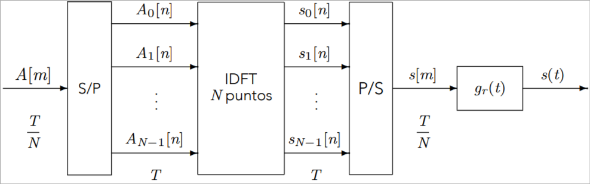

<style>
body {
    column-count: 2;
    column-gap: 2em;
    column-rule: 1px solid gray;
}
@media print {
    body {
        font-size: 9pt;
    }
}
h1, h2, h3, h4, h5, h6 {
    break-after: avoid;
}
h1, h2, h3 {
    font-variant: small-caps;
    column-span: all;
}
h1, h2 { text-align: center; }

h1 {
    margin-bottom: 0;
}
h2 {
    margin-top: 0.4em;
    margin-bottom: 0.2em;
}
h3 {
    margin-top: 0.4em;
    margin-bottom: 0.2em;
    border-bottom: 0.96px dashed rgba(128, 128, 128, 0.5);
}
h4 {
    margin-top: 0.1em;
    margin-bottom: -0.3em;
}
h5 {
    margin-top: 0.5em;
    margin-bottom: -0.4em;
    font-style: italic;
}

p {
    margin-top: 0.1em;
    margin-bottom: 0.1em;
    break-before: avoid;
    break-inside: avoid;
}
ul {
    margin-top: 0.6em;
}
li {
    break-before: avoid;
    break-inside: avoid
}
table {
    margin-left: auto;
    margin-right: auto;
    break-before: avoid;
    break-inside: avoid
}
.katex .katex-html>.newline {
    height: 0.2rem;
}
.pagebreak {
    column-span: all;
    border: none;
    break-after: page;
}

/* This allows me to put a code span or equation spanning all columns */
blockquote:has(> * > * > .katex),
blockquote:has(> pre):not(:has(> *:not(pre))) {
    column-span: all;
    border: none;
    background: transparent;
}
</style>

# Digital Communications - Midterm 2 formulas

## General

$$
P_e ≈ κ Q\left(\frac{d_{min}}{2σ_n}\right)
$$

$$
W = B_{\text{rad}} = 2πB
$$

#### Tx rates

$$
R_s = \frac{1}{T_s} \\
R_b = m R_s \\
m = \log_2 M \\
$$

## Spread Spectrum

* **Time division, frequency expansion**
* $A[n]$ transmitted $N$ times in period $T$

#### Chip time

$$
T_c = \frac{T}{N}
$$

#### Bandwidth

$$
B = \frac{N}{T} (1+α) = \frac{1}{T_c} (1+α) \\
$$

####

> ```mermaid
> %%{init: {'forceLegacyMathML':'true'} }%%
> flowchart LR
> A(["$$A[n]$$"])
> subgraph p ["$$p[n]$$"]
> upsample["$$\uparrow N$$"]
> w["$$w_N[m]$$"]
> seq(["$$\tilde{x}[n]$$"]) --> seq_mult(("$$\times$$"))
> 
> subgraph d_ ["d[n]"]
> subgraph d ["$$d(t)$$"]
> gc["$$g_c(t)$$"]
> heq[["$$h_{eq}(t)$$"]]
> n_add(("$$+$$"))
> rcv_fc["$$g_c(-t)$$"]
> end
> sample["Sampl. $$\,t=mT_c$$"]
> end
> 
> seq_(["$$\tilde{x}^*[m]$$"])
> seq__mult(("$$\times$$"))
> rcv_w["$$w_N[-m]$$"]
> downsample["$$\downarrow N$$"]
> end
> noise_(["$$\sqrt{2}e^{-jω_ct}n(t)$$"]) --> n_add
> q(["$$q[n]$$"])
> 
> A --> upsample --> w --> seq_mult
> seq_mult --"$$s[m]$$"--> gc --"$$s(t)$$"--> heq --"$$y(t)$$"--> n_add --"$$r(t)$$"--> rcv_fc
> rcv_fc --"$$v(t)$$"--> sample
> sample --"$$v[m]$$"--> seq__mult --> rcv_w --> downsample --> q
> 
> seq_ --> seq__mult
> ```
>
> $$
> d[m] = d(t) \Big|_{t=mT_c} = g_c(t) * h_{eq}(t) * g_c(-t) \Big|_{t=mT_c}
> $$
>
> $$
> p[n] = ∑_{m=0}^{N-1} ∑_{l=0}^{N-1} x[m] x^*[l] d[nN + l - m]
> $$

### Channel

> ```mermaid
> %%{init: {'forceLegacyMathML':'true'} }%%
> flowchart LR
> A(["$$A[n]$$"])
> filter[["$$g(t)$$"]]
> subgraph heq ["$$h_{eq}(t)$$"]
> carrier(["$$\sqrt{2}e^{jω_ct}$$"]) --> bp_mult(("$$\times$$"))
> real["$$\Re\{⋅\}$$"]
> ch["$$h(t)$$"]
> adder(("$$+$$"))
> carrier_(["$$\sqrt{2}e^{-jω_ct}$$"]) --> bb_mult(("$$\times$$"))
> end
> r(["$$r(t)$$"])
> %% rcv_filter["$$f(t)$$"]
> %% q(["$$q(t)$$"])
> 
> A --> filter --"$$s(t)$$"---> bp_mult
> bp_mult --> real --"$$x(t)$$"--> ch --> adder --"$$y(t)$$"--> bb_mult
> bb_mult --> r
> 
> noise(["$$n(t)$$"]) --> adder
> ```

### Transmission

#### Spreading

$$
s_n[m] = A[n] x[m]
$$

$$
s[m] = \{A[n] x[m-nN]\}_{n,m=0}^{\cdots,N-1}
$$

$$
\tilde{x}[m] = x [n \text{ mod } N]
$$

#### Shaping

$$
g(t) = ∑_{m=0}^{N-1} x[m] g_c(t-mT_c)
$$

$$
\begin{aligned}
    s(t) &= ∑_n ∑_{m=0}^{N-1} A[n] x[m] g_c(t-mT_c - nT) \\
    &= ∑_n A[n] ∑_{\mathclap{m=nN}}^{\mathclap{(n+1)N-1}} x[m-nN] g_c(t-mT_c) \\
\end{aligned}
$$

#### Reception — Despreading

$$
q[n] = ∑_{m=0}^{N-1} x^*[m] v[m+nN]
$$

#### Energy

$$
S_s(jω) = \frac{1}{T}
    \underbrace{E_s}_{\mathclap{S_A(e^{jωT})}} |G_c(jω)|^2
    \underbrace{\left|∑_{m=0}^{N-1} x[m] e^{-jωmT_c}\right|^2}_{S_x(e^{jωT_c})}
$$

<!-- $$
G(jω) = G_c(jω) ∑_{m=0}^{N-1} x[m] e^{-jωmT_c}
$$ -->

## Multicarrier Modulation

* Frequency division
* $A[m]$ transmitted through $N$ channels simultaneously

#### Bandwidth

$$
B_k = \frac{B}{N} \\
R_{s;k} = B_k = \frac{B}{N}
$$

#### Shaping

$$
s(t) = ∑_{k=0}^{N-1} s_k(t) = ∑_{k=0}^{N-1} A_k[n] ϕ_k(t-nT)
$$

#### Energy

Assuming uncorrelated $A_k[n]$ sequences:

$$
S(jω) = ∑_{k=0}^{N-1} S_k(jω) = \frac{1}{T} ∑_{k=0}^{N-1} E_k |ϕ_k(jω)|^2
$$

#### Modulator



#### Demodulator


### Cyclic prefix

* Removes ISI and ICI

> $$
> \tilde{s}[m]
> = \underbrace{s[N-M], s[N-M+1], …, s[N-1]}_{\text{Last M samples of } s[m]},
> \underbrace{s[0], s[1], …, s[N-1]}_{s[m]} \\
> $$

### Probability of error

$$
P_e^{(k)} ≈ Q\left(\frac{\frac{N}{T}|D[k]| d_{min}^{A[n]}}{2σ_z}\right)
$$

$$
D[k] = \text{DFT}\{d[n]\}
$$
