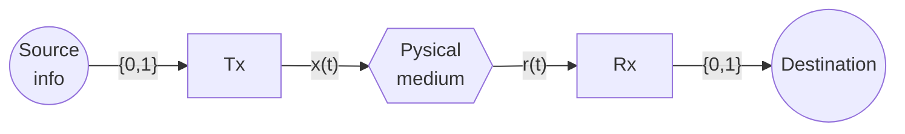
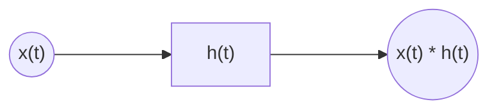
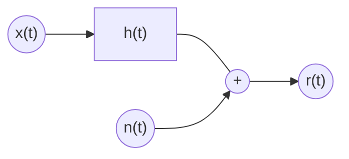
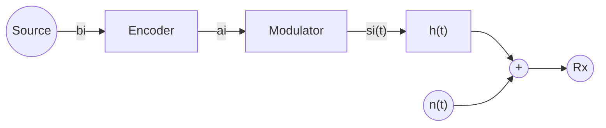
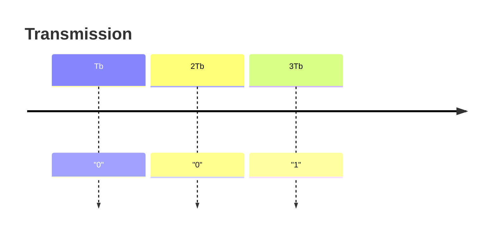

# Chapter 1. Introduction

* Baseband vs Bandpass Channels
* Single symbol Tx vs multi-symbol Tx
* BLock diagram of a digital communications system



$$
r(t) = f(x(t)) + n(t) = h(t) * x(t) + n(t)
$$

Where $f(x(t))$ is a linear function



### Example of probability of error

Assuming both transmitter and receiver are optimized, assume we send the sequence `0011011010` and receive `1011011011`. THe probaility of error is $P_e = \frac{2}{10} = 20%$

## Noise



<!-- ```mermaid
xychart-beta
line [0, 0, 0, 1, 1, 1, 1, 0, 0, 0]
```
-->



* $B$: symbols in binary format
* $N$: dimension
* $M$: number of combinations
* $\bar{A}$: constellation, symbols in vector format

> **Example**
> 
> Let $M=4$. The alphabet and constellation are:
> 
> $$
> \begin{cases}
> b_1 = 00 \\
> b_2 = 01 \\
> b_3 = 10 \\
> b_4 = 11
> \end{cases}
> $$
> 
> $$
> \bar{A} = \left\{
    > \begin{bmatrix}
        > 1 \\
        > 1
    > \end{bmatrix},
    > \begin{bmatrix}
        > -1 \\
        > 1
    > \end{bmatrix},
    > \begin{bmatrix}
        > 1 \\
        > -1
    > \end{bmatrix},
    > \begin{bmatrix}
        > -1 \\
        > -1
    > \end{bmatrix}
> \right\}
> \text{ (called QPSK)}
> $$

* Generating base: set of signals $\{ϕ_1(t), …, ϕ_N(t)\}$

$$
s(t) = \{s_1(t), …, s_M(t)\}
$$

Where

$$
s_i(t) = a_{i1} ϕ_1(t) + … + a_{iN} ϕ_N(t)
$$

### Example

Say we want a throughput of $R_b = 10 {Mbit \over s} = 10^7 {bit \over s}$. Then, we'll need a transmission
time per bit of $T_b = {1 \over R_b} 10^{-7} {sec \over bit}$.

Taking the previous transmission as an example, we'd have a timeline such as this one:



Here, the first sequence of "00" is encoded by $b_1$, meaning the transmission time per symbol is $T_s = log_2M · T_b = 2T_b$.
