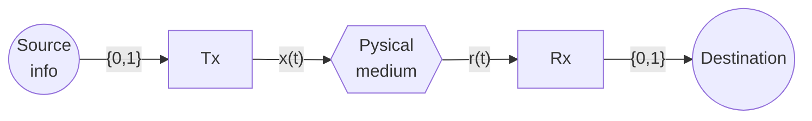
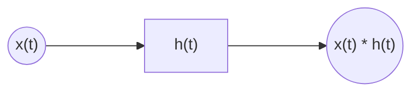

# Chapter 1. Introduction

* Baseband vs Bandpass Channels
* Single symbol Tx vs multi-symbol Tx
* BLock diagram of a digital communications system

$$
r(t) = f(x(t)) + n(t) = h(t) * x(t) + n(t)
$$

Where $f(x(t))$ is a linear function

